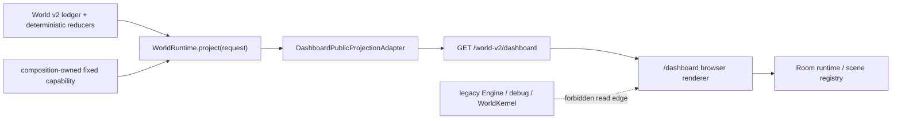

# ADR-0007: Dashboard 默认迁移为 World v2 公共只读投影

- 状态：accepted for implementation
- 日期：2026-07-16
- 范围：`/dashboard` 的默认浏览体验、其浏览器数据契约及 HTTP read seam；不改像素房间素材、room runtime 或 Dashboard 的视觉布局

## 决策

`/dashboard` 的默认数据源必须切换到一个 World v2 专属、只读、按 viewer capability 固定的 Dashboard projection。浏览器不得再请求旧 `Engine` / `WorldKernel` 的 `/debug/*`、`/world-runtime/*`、`/proactive/*` 或 `/world/*` 路由来渲染页面；也不得在页面不可用时回退到这些路由。

该投影 Module 的外部 Interface 只有：

```text
GET /world-v2/dashboard
  -> DashboardProjectionDTO (public, redacted, versioned, cacheable)
  -> 503/403/422 (typed fail-closed state)
```

`WorldRuntime.project(ProjectionRequest)` 仍是唯一的 world read seam；HTTP composition 持有固定的 `room_renderer` / `dashboard_public` request capability，浏览器本身不能提交 `world_id`、cursor、viewer kind、permissions 或 redaction policy。页面是 renderer，不是第二个状态拥有者、调度器或 operator console。

`/world-v2/room` 保留为 Godot/极简房间 renderer 的极小 DTO。它**不能**被扩展为 dashboard 的万能 payload；Dashboard 需要的额外公开展示字段应由 Dashboard projection Module 从同一份 World v2 projection 编译，而不是由浏览器拼接另一个旧快照。

## 现状和问题

已存在、且可复用的深 Module：

| 层 | 当前位置 | 已有保证 |
| --- | --- | --- |
| world read seam | `WorldV2TurnApplication.project()` / `ProjectionAuthority` | deterministic projection、capability / redaction 校验 |
| DTO compiler | `world_v2/dashboard_projection_adapter.py` | 只接受 `room_renderer` + `room-public-v1`；不读 ledger、Engine 或 legacy snapshot |
| composition capability | `world_v2/http_capture_host.py` | 只铸造一个固定 world/viewer/policy request |
| public route | `GET /world-v2/room` | 冷 host 返回 503；不 bootstrap、不 fallback、不泄露 `world_id`、affect、media、debug |

当前 `/dashboard` 仍由 `dashboard_ui.py` 内联脚本驱动，并默认依赖：

| 当前浏览器请求 | 当前用途 | 为什么不能成为 v2 默认路径 |
| --- | --- | --- |
| `/debug/users` | 选择用户 | 触及 archive Engine；v2 HTTP composition 是单一 canonical user/world |
| `/debug/{user}/context` | 房间 actor、情绪、注意力、日历、raw state | legacy context 与 private/diagnostic state 混合；路由参数可选 user；不是 v2 projection |
| `/world-runtime/enablement` | 世界审计 | archive Engine / `WorldKernel` 的 operator 视图，不是 viewer projection |
| `/proactive/{user}` | 手动触发主动行为 | browser write/dispatch surface，不应混入只读 Dashboard |
| `/world/*` | 旧命令/账本 | archive-only operator capability；不能被视觉页读取或调用 |

当前 `DashboardRoomProjectionDTO` 只有 `cursor`、`projection_hash` 和 `route(scene_id, action_id, availability)`。它已足够将房间从旧 `snapshot.dashboard.scene` 脱钩，但**明确不足**以替代页面中的活动文案、时间线、日历、任务、世界审计和 raw-state 折叠面板。把旧 `snapshot` 作为补充请求会重新制造双权威，因此必须先扩展 v2 projection，而非先改 URL。

## 目标 Module 与 DTO

新增 `DashboardPublicProjectionAdapter`。它与当前 `DashboardProjectionAdapter` 并列，不从它反序列化，也不让 UI 直接消费 `WorldProjection`。两者可共享内部 route catalog，但有各自固定的 viewer policy 和 DTO schema。

建议的最小外部 Interface：

```python
class DashboardPublicProjectionCapture(Protocol):
    def capture(self, request: ProjectionRequest) -> DashboardPublicProjectionDTO: ...
```

建议的 wire schema：`world-v2-dashboard.1`：

```json
{
  "schema_version": "world-v2-dashboard.1",
  "cursor": {"world_revision": 17, "ledger_sequence": 42},
  "projection_hash": "sha256",
  "room": {
    "scene_id": "zhizhi-home-legacy",
    "action_id": "study",
    "availability": "busy"
  },
  "now": {
    "activity_id": "focused_work",
    "activity_label": "在看资料",
    "availability": "busy"
  },
  "agenda": [
    {"slot_id": "agenda:...", "starts_at": "RFC3339", "status": "scheduled",
     "activity_id": "relax", "activity_label": "放松一下"}
  ],
  "notices": [
    {"notice_id": "notice:...", "kind": "pending_commitment", "label": "有件事还没收住"}
  ],
  "freshness": {"observed_at": "RFC3339", "stale_after_seconds": 30}
}
```

硬约束：

1. `activity_id`、`scene_id`、`action_id`、`notice.kind` 是有限 route/display identifier；display label 只能来自已接受、允许外显的 public display state / public activity catalog，不能是 LLM 自由心理摘要。
2. `agenda` 只允许已接受且按 policy 可见的 planned/active public slots；不得含私人地点 ref、participant、message/fact content、future media candidate、未提交 proposal、internal rationale、private impression 或预算/账本 ref。
3. `notices` 是有限、无内容的公开提示，不是旧 social task 的原文、原因或 due-at。无法可靠映射时省略条目，不能从 legacy state 推断。
4. 不提供 `state`、`life_runtime`、`calendar` raw events、`reasons`、`mood_label`、`phone_label`、用户列表、world id、semantic hash、operator health、open action id 或任何 debug 字段。
5. `projection_hash` 是 DTO 自己的 canonical public payload hash；它可用于 ETag/刷新比较，但不可作为 internal semantic hash 的旁路。
6. 一个 capture 内的 `room`、`now`、`agenda`、`notices` 必须来自同一个 `ProjectionCursor`，并在编译时验证。不能分别读取不同 cursor 的 reducers 后由浏览器拼合。

如果 `WorldProjection` 尚未拥有上述 public facts，先在 projection schema/reducer 中实现明确的 public projection field；不得由 Dashboard adapter 直接读 SQLite、ledger event、`WorldRuntime` 私有成员或 legacy `daemon_dashboard_projection()` 补齐。

## 迁移设计



### Phase A — projection authority first

1. 为 dashboard 增加独立、固定的 `dashboard_public` viewer kind 或保留 `room_renderer` 且增加**不同**的 fixed `dashboard-public-v1` redaction policy；二者不可接受 caller-controlled permissions。选择前者可避免 room DTO 随 dashboard 增长而膨胀，建议采用前者。
2. 在 `ProjectionAuthority` 写出 grant，`HttpV2CaptureHost` 的 composition-only request issuer 只铸造这个 capability。
3. 实现 DTO compiler 和纯 route/display catalog。catalog 必须是版本化 composition data；缺 map、不可见 status 或 schema 不能解释时返回固定 `unavailable/idle` 或省略可选字段。
4. 新增 `GET /world-v2/dashboard`。与 `/world-v2/room` 一样：host 未初始化为 503；capture / redaction 异常为 403/503；绝不调用 `_http_v2_capture()`、`engine`、`WorldKernel`、debug 或 archive fallback。
5. `ETag` 用 `projection_hash`，浏览器发送 `If-None-Match` 可返回 304。响应 `Cache-Control: no-store`（本地角色状态不允许共享缓存）；poll 间隔以 `freshness` 为提示，不触发 write。

### Phase B — browser renderer 切换

1. 将 `dashboard_ui.py` 拆成静态 markup、纯 `renderDashboard(dto)` 与 fetch adapter；不要把 v2 与 legacy fetch 写在同一 `loadContext()` 内。
2. 默认 `loadDashboardProjection()` 只 fetch `/world-v2/dashboard`，验证 schema、有限字段、cursor 单调性和 `projection_hash`，然后调用 `roomRuntime.setActor(dto.room)`。
3. 移除用户下拉、`runProactive()`、raw daemon state、legacy world-audit side栏；若仍需运维诊断，迁往 `/world-console`，并以独立 operator auth/route 实现，不能在 `/dashboard` 隐藏元素中保留请求。
4. 对旧视觉层无法由 public DTO 支持的部分，优先以“不可用 / 暂无公开安排”空态渲染；不要以 legacy snapshot 兜底。页面在 503/403/schema error 时冻结上一个**已验证** DTO（若有），明确显示“World v2 投影暂不可用”；首次加载则固定 `unavailable/idle` actor。
5. 房间 scene registry 仍是静态 renderer asset。DTO 仅给 `scene_id`；未知 id 必须在 `roomDefinition()` 落到明确的 shipped unavailable scene，不能默认选第一个私人场景或把 authority ref 透给 renderer。

### Phase C — remove the selected legacy read edges

1. Dashboard 的 JS bundle 中不存在 `/debug/`、`/world-runtime/`、`/proactive/`、`/world/` 或 `snapshot.dashboard` token。
2. `/dashboard` 默认请求不构造 `_LazyArchiveEngine`；测试中替换 `engine` 为会抛错的 double。
3. 保留 legacy dashboard 只能作为明确命名、operator-gated archive route（例如 `/archive/dashboard`），默认链接和 refresh 不得指向它。直到该路由具有访问控制前，不公开部署它。
4. 只有迁移完成、浏览器 contract tests 与 selected display architecture guard 通过后，才可删除 legacy Dashboard UI 相关 fetch/render paths。删除不等于删除旧 archive world endpoints；它们需按自己的平台迁移计划隔离。

## DTO 映射矩阵

| 现有 UI 区域 | v2 输入 | 迁移动作 | 禁止替代 |
| --- | --- | --- | --- |
| room actor | `room.scene_id/action_id/availability` | 已可迁移；调整 `applyScene()` 读取 `dto.room` | `snapshot.dashboard.scene` |
| 顶部状态 / 现在 | `now.activity_label`, `availability` | 仅显示 public label 和状态 | affect、phone、私人 location |
| 下一安排 | `agenda[]` | 仅显示有限 public slots | legacy `next_plan`、calendar raw event |
| 未收住事项 | `notices[]` | 显示无内容 public notice | social task reason/due/time |
| 同步状态 | `cursor`, `freshness` | 显示更新时间 / stale | legacy enablement / action IDs |
| 用户选择 | 无 | 删除；v2 composition identity 固定 | `/debug/users` |
| 手动 proactive | 无 | 移至 authenticated operator console 或不提供 | `/proactive/{user}` |
| 原始状态 / 世界审计 | 无 | 移至独立 operator projection | `state`, ledger, enablement |
| 视觉预览 | URL-local only | 保持不写 world 的 visual preview | 将 preview 写进 projection |

## 隐私、故障与一致性策略

- **Fail closed**：不存在 v2 capture、权限错、DTO schema 无法验证、route catalog 没有映射时，不能请求 archive data；分别使用 HTTP 503、403、422（renderer 使用 safe empty state）。
- **最小泄露**：浏览器不接触 `world_id`，即使同机本地也不因“可信 UI”放宽；DTO whitelist 由 dataclass `to_payload()` 固定，禁止 `model_dump()` 透传 projection。
- **不写入**：GET 不初始化 host、不开世界、不开预算账户、不 tick、不 drain、不生成 Action，不更新 last-seen。
- **一致刷新**：同 `projection_hash` 不重绘；cursor 回退或 hash 不匹配视为异常，保留最后已验证 DTO。服务重启后首次 503 是合法而非 legacy fallback 条件。
- **公开表达**：情绪或关系只在已接受且被角色选择的 display state 明确投影时，经过有限 label map 显示；不能显示 private impression、未表达 affect、model rationale 或“为什么这个动作”的内部解释。

## 验收与测试

### Python / HTTP

1. DTO unit tests：schema whitelist、canonical hash、field validators、未知 route/public status、禁止 private/diagnostic field、同 cursor capture。
2. projection authority attacks：错误 capability、权限非空、错误 viewer/policy、跨 world、非 `RoomProjectionView`/非 dashboard view 一律拒绝。
3. route tests：`/world-v2/dashboard` 在 v2 host 就绪时仅返回 dashboard schema；不含禁字字段；在 cold host 返回 503，mock `build_http_v2_capture_host` 和 `engine` 确认均未调用；config/capture 错误无 legacy fallback。
4. write-on-read tests：读取前后 ledger commit count、logical clock、budget accounts、Action/TriggerProcess 数量完全相等。
5. projection stability tests：同 ledger cursor DTO / ETag 相同；仅允许的 accepted public event 会改变 DTO；private impression、unexpressed affect、media preview、provider receipt 不会改变 public DTO 或不被泄露。
6. static architecture guard 扩展：扫描选定 Dashboard bundle/source，禁止 legacy endpoint/token 和 `companion_daemon.engine` / `world` / reducer imports；允许它只依赖 DTO schema 与 renderer assets。

### Browser / JS

1. contract fixture：以 `world-v2-dashboard.1` fixture 测试 `renderDashboard()`，断言每个 DOM 区域只读 DTO；不存在 user selector/proactive 请求/raw-state 输出。
2. 503、403、malformed DTO、unknown route、cursor rollback、304、stale DTO、轮询 race 的 deterministic tests。
3. room runtime fixture：未知 public `scene_id` 渲染 unavailable scene，不选择第一个 registry scene；现有 canvas visual baseline 仍通过。
4. network test / Playwright（或当前 browser test harness）：加载 `/dashboard` 时对所有请求断言不包含 legacy endpoints；将 app `engine` 替换为 throw-on-access double，页面仍可渲染 v2 fixture。

### Cutover gate

只有下列全部为真，才可称 `/dashboard` 默认已迁移：

- 默认页面所有网络 read 都来自 `/world-v2/dashboard` 与静态 asset；
- `engine` 在 Dashboard request 生命周期未被实例化；
- 冷 v2 host、无 route、权限拒绝均无 archive fallback；
- 当前 Dashboard visual tests 与新增 v2 browser contract tests 通过；
- `ruff`、World v2 suite、static dependency guard、scenario replay hash 均通过；
- operator 功能已从浏览器默认页隔离，或有明确的受控替代入口。

## 需协调的当前用户工作区文件

下列文件当前为未提交修改。迁移实现者不得覆盖、格式化或顺带重构它们；需要由其所有者明确交接或单独 worktree 后再改：

| 文件 / 路径 | 原因 |
| --- | --- |
| `src/companion_daemon/dashboard_ui.py` | 默认页面 markup、legacy fetch/render、scene picker；本 ADR 的主要 browser 切口 |
| `src/companion_daemon/static/room/runtime.js` | actor scene contract、visual preview 与 canvas runtime |
| `tests/test_dashboard.py` | legacy Dashboard HTTP/HTML contract |
| `tests/js/room_runtime.test.js` | 房间 runtime visual/behavior contract |
| `assets/dashboard/rooms/zhizhi-home/**` | legacy scene registry、bundle、draft layers |
| `assets/dashboard/asset-kits/**`, `assets/dashboard/tile-rooms/**`, `assets/dashboard/rooms/scene-registry.json` | 新场景/素材并行工作树；需要明确哪些 `scene_id` 是 shipped public routes |
| `docs/dashboard-scene-engine.md`, `scripts/build_tile_room.py`, `src/companion_daemon/static/room/tile-*.js`, `src/companion_daemon/tile_room_compiler.py`, 相应 tests | tile renderer 计划，不能被 world migration 擅自选择为默认 renderer |

`src/companion_daemon/app.py` 当前无未提交修改，可由 World v2 实施者在独立小提交中增加新 read-only route；`world_v2/dashboard_projection_adapter.py` 也应优先以新增 sibling Module 的方式演进，避免把 Dashboard 与 Godot 的最小 room DTO 耦合。

## 明确不做

- 不把 Dashboard 当作用户对话平台、主动行为按钮或 scheduler；
- 不为了复刻旧页面而把 private affect、关系账本、memory、media preview、行动回执或 raw calendar 放进 public DTO；
- 不以 feature flag 在每次 `loadContext()` 中双读 v1/v2；灰度若需要，必须在 server route / deployment 层按完整页面版本切分，并记录一次性选择；
- 不让图片机、room renderer 或 Dashboard 直接写 World v2；
- 不因 v2 host 冷启动而 bootstrap 或回退到 archive Engine。

## 后果

默认 Dashboard 会暂时比旧页面信息更少，这是有意的：它把可展示内容约束为已接受、允许外显、同一 cursor 的世界事实。后续每个 UI 字段的增加必须先增加到 World v2 公共 projection，再通过这个深 Module 同步获得隐私、重放和 no-dual-authority 保证，而不是重新打开 legacy snapshot 的旁路。
