# World V2 Accepted Effect Compiler 设计

> 状态：设计草案，尚未授权启用 accepted manifest 执行。
>
> 适用范围：`AcceptanceManifestV2.status == "accepted"` 的领域 mutation 编译、规划、原子记录和重放验证。本文不改变 rejected/stale 路径，也不授权 Action、Budget、Expression 的外部副作用。

## 1. 文档目的

Phase 4A 已经能够把模型输出保存为可审计的 `ProposalAudit`，Phase 4B 的 rejected/stale manifest 也已形成闭环。但 accepted 路径不能通过打开一个 parser 开关完成：accepted 会把“模型提出的通用 TypedChange”转换成“能够修改世界状态的具体 WorldEvent”。这个转换同时跨越了模型信任域、领域 schema、ledger 身份、权限消费和原子提交，是新的高权限 seam。

本文定义一个深模块 `AcceptedEffectCompiler`。它以尽量小的 Interface 隐藏以下 Implementation：

- 从精确 ledger cursor 读取并签发 proposal authority；
- 按静态 ownership/coverage 矩阵选择唯一 compiler；
- canonical decode/encode；
- 正向编译和独立 reverse verification；
- 生成不可伪造的 verified handle；
- 确定性 effect 排序、事件身份和 causation；
- 构造并持久化完整 manifest authority；
- 在一个 ledger transaction 中原子记录 manifest 与全部 effects；
- replay 时重新验证相同的权限链；
- 对资源限制和错误码进行统一治理。

本文使用以下术语：

- **Module**：具有一个 Interface 和内部 Implementation 的模块；
- **Interface**：调用者必须知道的全部契约，包括参数、顺序、不变量和错误；
- **Seam**：Module 的 Interface 所在位置；
- **Adapter**：在内部 seam 上实现特定领域变化的编译器；
- **Handle**：由可信 Module 签发、进程内不可序列化的 capability，不是普通 DTO。

## 2. 为什么不能直接翻开 accepted 开关

当前 accepted parser gate 是最后一道显式 fail-closed 防线。直接设置 `accepted_integration_enabled=True` 至少会跳过以下尚未闭合的问题。

### 2.1 ProposalAudit 与 ledger cursor 尚未形成不可伪造的 authority

仅有 `ProposalAuditProjection + ProjectionCursor` 两个值，不代表该 audit 确实存在于该 world、该 cursor。调用者可以把另一个 world 中 revision 相同的 audit 与 cursor 拼在一起，也可以构造尚未入账的 audit。真正的 authority 必须由 ledger projection reader 在精确 cursor 上查询后签发。

精确 cursor authority 至少绑定：

- `world_id`；
- `world_revision`、`deliberation_revision`、`ledger_sequence`；
- snapshot/semantic hash，或等价的 committed-ledger prefix hash；
- ProposalRecorded event id、event type、payload hash及其 ledger sequence；
- ProposalAudit canonical bytes/hash；
- reader policy version/digest。

### 2.2 通用 TypedChange 与具体 mutation payload 不是同一种哈希

`full_change_authority_hash` 是 ProposalEnvelope 中完整 `TypedChange` 的领域分隔哈希；既有 mutation payload 的 `accepted_change_hash` 通常是具体领域 mutation 的自校验哈希，例如 fact mutation hash。两者不能互相覆盖。

正确关系是：

1. manifest authority ref 绑定 `full_change_authority_hash`；
2. concrete mutation 继续使用其既有 `accepted_change_hash`；
3. compiler 的 reverse verifier 证明 concrete mutation 与 TypedChange 语义等价；
4. replay resolver 同时验证两种哈希及其交叉关系。

### 2.3 当前 registry 和 compiled payload 若是普通公开对象，可以被绕过

如果调用者可以：

- 自行构造 registry 并注册任意 Adapter；
- 将 `fact_transition` 映射成 `NpcRegistered`；
- 自行填写 compiler digest；
- 直接构造 `CompiledDomainPayload` 交给 planner；

那么 registry 只是一份描述性 metadata，并非权限。planner 最终仍是“任意合法 event payload 写入器”。因此生产 Interface 不能接收裸 compiled DTO，只能接收由 installed registry 签发的 verified handle。

### 2.4 manifest 必须精确覆盖整批 effects

accepted transaction 不是“记录一个决定，再陆续写若干事件”。它必须是精确 batch：

```text
[AcceptanceRecorded(accepted manifest), effect ordinal 0, ..., effect ordinal N-1]
```

缺失、额外、重复、乱序、event id/type/payload hash 不一致都必须导致整个 transaction 回滚。否则 manifest 不能证明实际发生了什么。

### 2.5 replay 必须能够重新证明，而不是信任一次性内存对象

进程内 Handle 不可持久化。真正持久化的 manifest 必须包含 replay 所需的 compiler、codec、verifier、registry 和 proposal metadata；或者这些 metadata 必须能由 reducer bundle version 唯一重建。若只在 planner 内短暂存在，重放时就只能信任历史 payload。

### 2.6 accepted 会使模型内容获得世界写权限

rejected/stale 只保存审计结论；accepted 会触发 reducer。任何未闭合的 seam 都会从“错误审计”升级成“错误世界状态”。所以启用门槛必须是整条链同时闭合，而不是 parser 能解析 accepted。

## 3. 总体架构

```mermaid
flowchart LR
    PA["ProposalAudit event\ncanonical ProposalEnvelope"]
    LR["Trusted Ledger Reader\nexact cursor lookup"]
    AH["PinnedProposalAuthorityHandle\nprocess-local capability"]
    OC["Installed Ownership & Coverage Registry\nstatic immutable manifest"]
    CC["Domain Compiler Adapter\ncanonical codec + compile"]
    RV["Independent Reverse Verifier"]
    VH["VerifiedCompiledEffectHandle\nprocess-local capability"]
    PL["Accepted Effect Planner\norder + identity + causation"]
    EP["AcceptedExecutionPlan"]
    MB["Manifest Builder\ncomplete durable metadata"]
    AM["AcceptanceManifestV2"]
    AR["Atomic Recorder\nmanifest + exact effects"]
    LG["World Ledger"]
    RR["Replay Authority Resolver"]
    RD["Domain Reducers"]

    PA --> LR
    LR --> AH
    AH --> CC
    OC --> CC
    CC --> RV
    RV --> VH
    VH --> PL
    PL --> EP
    EP --> MB
    AH --> MB
    OC --> MB
    MB --> AM
    AM --> AR
    EP --> AR
    AR --> LG
    LG --> RR
    OC --> RR
    RR --> RD
```



权限流的唯一合法方向是：

```text
authority
  -> installed compiler
  -> independently verified handle
  -> deterministic planner
  -> complete manifest
  -> atomic recorder
  -> replay authority resolver
  -> domain reducer
```

不得存在以下旁路：

- `ProposalAuditProjection -> Adapter`，绕过 trusted reader；
- `TypedChange -> arbitrary event payload`，绕过 ownership registry；
- `CompiledDomainPayload DTO -> planner`，绕过 reverse verifier；
- `ExecutionPlan.world_events() -> ledger.commit()`，绕过 manifest builder；
- `accepted manifest -> reducer`，但未验证同 batch exact effect；
- replay 时仅检查 payload schema，不检查 compiler authority metadata。

## 4. Module 与 Interface

### 4.1 TrustedProposalAuthorityReader

这是唯一签发 `PinnedProposalAuthorityHandle` 的 Module。

建议 Interface：

```python
class TrustedProposalAuthorityReader:
    def pin(
        self,
        *,
        world_id: str,
        cursor: ProjectionCursor,
        proposal_event_ref: str,
    ) -> PinnedProposalAuthorityHandle: ...
```

调用者不能传入 `ProposalAuditProjection` 让 reader 背书。reader 必须自己从指定 ledger prefix 读取，并验证：

- event 是该 world 的 `ProposalRecorded` v2；
- event revision/sequence 不晚于 cursor；
- event payload hash 与 ledger bytes 一致；
- ProposalAudit canonical validation 成功；
- proposal `evaluated_world_revision == cursor.world_revision`；
- audit 对应的完整 ModelResult/Proposal audit transaction 已提交；
- cursor 的 world、deliberation、sequence 和 prefix hash 相互一致。

Handle 应包含但不公开可变字段：

```text
world_id
cursor
ledger_prefix_hash / snapshot_semantic_hash
proposal_event_ref
proposal_event_world_or_deliberation_revision
proposal_event_ledger_sequence
proposal_event_payload_hash
proposal_audit
reader_policy_version/digest
issuer capability tag
```

Handle 必须：

- 不能由公共构造器创建；
- 不能 pickle、copy、deepcopy 或 JSON serialize；
- 不能跨进程恢复；
- 不能用普通 Pydantic `model_construct` 伪造；
- 只能被同一 installed compiler Module 消费；
- 返回 audit 时只返回 frozen defensive view。

Python 模块下划线不是安全边界。生产 issuer 不能是“接收任意 audit/cursor 的私有函数”。

### 4.2 InstalledDomainCompilerRegistry

registry 是静态安装合同，不是调用者可扩展的插件容器。生产进程只能使用一个由构建产物生成并在启动时验证的 registry 实例。

建议 Interface：

```python
class InstalledDomainCompilerRegistry:
    @property
    def manifest_version(self) -> str: ...

    @property
    def manifest_digest(self) -> str: ...

    def compile_verified(
        self,
        *,
        authority: PinnedProposalAuthorityHandle,
        change_id: str,
        context: AcceptanceCompilationContext,
    ) -> VerifiedCompiledEffectHandle: ...
```

调用者不传 Adapter、不传 compiler key、不传 event type，也不传 `TypedChange` 副本。registry 从 authority 中的 ProposalEnvelope 按 change id 取得唯一 TypedChange，并根据静态矩阵选择唯一 Adapter。这样 Interface 更小，也避免调用者提交“看似相同”的第二份 change。

测试 registry 可以使用内部 seam 安装 fake Adapter，但其输出必须带 `test_only_untrusted` provenance，并被生产 planner 拒绝。

### 4.3 VerifiedCompiledEffectHandle

这是 reverse verification 成功后的进程内 capability。它与持久化 DTO 分离。

Handle 内部闭合：

- source authority handle identity；
- exact TypedChange canonical bytes/hash；
- concrete event type；
- concrete canonical payload bytes/hash；
- concrete domain idempotency identity；
- compiler、codec、reverse verifier、output contract版本和 digest；
- dependency digests；
- registry version/digest；
- verification receipt hash；
- issuer capability tag。

planner 只接收此 Handle，不接收 `CompiledDomainPayload`。

### 4.4 AcceptedEffectPlanner

planner 是 effect ordinal、event id、idempotency key 和 causation chain 的唯一所有者。

建议 Interface：

```python
class AcceptedEffectPlanner:
    def plan(
        self,
        *,
        context: AcceptanceCompilationContext,
        effects: Sequence[VerifiedCompiledEffectHandle],
    ) -> AcceptedExecutionPlan: ...
```

planner 必须验证：

- 所有 handles 来自同一 installed registry；
- 所有 handles 绑定同一 world 和同一 pre-acceptance cursor；
- 每个 domain change authority 只消费一次；
- effect count、单 payload、总 payload受限；
- 顺序满足显式依赖和 entity preconditions；
- 无依赖关系时使用稳定 tie-break；
- event identity 由 payload 的安装 identity contract 产生；
- event id 绑定完整 effect metadata；
- 首个 effect causation 指向 AcceptanceRecorded event id，后续 effect 指向前一个 effect event id；
- plan 本身可无损转换为合法 manifest effects。

planner 不决定角色是否应该实施变化；它只把 acceptance 已选择的 authorities 变成确定性执行计划。

### 4.5 AcceptedManifestBuilder

manifest builder 同时消费 pinned proposal authorities 与 execution plan，构造完整 `AcceptanceManifestV2`。它必须重新验证，而非简单复制：

- proposals 按 proposal id 排序且 exact re-derive；
- authorized effects ordinal 连续；
- plan 中每个 authority ref 存在于对应 proposal；
- effect payload metadata 与 verified receipt 一致；
- 每个 selected domain authority 只出现一次；
- manifest evaluated revision 等于 plan pre-world revision；
- manifest hash覆盖完整持久化 metadata。

### 4.6 AcceptedAtomicRecorder

唯一允许提交 accepted batch 的 Module。

建议 Interface：

```python
class AcceptedAtomicRecorder:
    def record(
        self,
        *,
        manifest: VerifiedAcceptedManifestHandle,
        plan: AcceptedExecutionPlanHandle,
        expected_cursor: ProjectionCursor,
    ) -> CommitReceipt: ...
```

普通 `ledger.commit(events)` 不应接受 accepted manifest，除非调用路径携带 recorder capability。recorder 重新生成而不是接受调用者提供的 events，并一次性提交：

```text
index 0      AcceptanceRecorded(manifest)
index 1      authorized_effects[0]
...
index N      authorized_effects[N-1]
```

### 4.7 ReplayAuthorityResolver

replay resolver 是 reducer 的统一权限入口。领域 reducer 不再各自实现“找最后一个 AcceptanceRecorded”的逻辑。

建议 Interface：

```python
class ReplayAuthorityResolver:
    def resolve_domain_mutation(
        self,
        *,
        state: ReducerState,
        event: WorldEvent,
        mutation_binding: AcceptedMutationBinding,
    ) -> ResolvedAcceptedAuthority: ...
```

它分两路：

- v2：manifest exact effect、ordinal/revision window、proposal audit、compiler metadata、reverse verifier和concrete mutation全部验证；
- legacy：保留既有 adjacent AcceptanceRecorded + typed proposal registry语义。

若事件命中 v2 manifest effect，任何 v2 验证失败都必须直接拒绝，不能降级 legacy。

## 5. 静态 Ownership/Coverage 矩阵

### 5.1 目的

矩阵回答两个不同问题：

- **coverage**：某个 ProposalEnvelope change kind/transition 是否支持 accepted 执行；
- **ownership**：若支持，哪些 concrete event type、codec、compiler和verifier唯一拥有它。

不存在“event 已安装且有 idempotency identity，所以任意 compiler 都可以拥有”的规则。

### 5.2 Canonical 格式

建议每项使用以下 frozen schema：

```yaml
proposal_contract:
  schema_registry_version: world-v2-proposals.1
  change_kind: fact_transition
  transition: commit
  payload_schema: fact_transition.v1
  payload_version: 1

coverage:
  status: supported                 # supported | unsupported
  reason_code: null                 # unsupported 时必需

ownership:
  concrete_event_types:
    - FactCommitted
  output_payload_contract_ref: fact-authorized-mutation.1
  output_payload_contract_digest: <sha256>
  domain_identity_contract_ref: fact-mutation-identity.1
  domain_identity_contract_digest: <sha256>

compiler:
  compiler_ref: fact-acceptance-compiler.1
  compiler_digest: <sha256>
  canonical_codec_ref: fact-acceptance-codec.1
  canonical_codec_digest: <sha256>
  reverse_verifier_ref: fact-acceptance-reverse-verifier.1
  reverse_verifier_digest: <sha256>

dependencies:
  - name: fact-schema
    digest: <sha256>
  - name: evidence-contract
    digest: <sha256>

limits:
  max_payload_bytes: 65536
  max_nodes: 2048
  max_depth: 24
```

矩阵整体 canonical sort key：

```text
(schema_registry_version, change_kind, transition, payload_schema, payload_version)
```

要求：

- key 全局唯一；
- concrete event type 全局只能有一个 owner；
- supported 项必须有完整 ownership/compiler/limits；
- unsupported 项只能携带稳定 reason code，不能携带半套 compiler metadata；
- `change_kind -> event type` 必须由代码审查后的静态合同声明；
- registry manifest digest 覆盖全部 supported 与 unsupported 项；
- registry version变化时 digest 必须变化；digest变化不一定要求版本变化，但生产部署必须 pin 两者；
- 构建时、启动时和测试时分别验证同一份 canonical matrix；
- Adapter 不得在运行时追加 ownership。

### 5.3 Coverage 初始策略

初始矩阵中所有 change transitions 均为 explicit unsupported。第一条纵切只将一个能够完整 reverse verify 的领域 transition 改为 supported。不得为了提高 coverage 而使用 generic pass-through compiler。

## 6. Exact Cursor Capability 合同

### 6.1 Cursor 的含义

`ProjectionCursor` 三个数字不足以独立证明 ledger prefix。reader 必须同时绑定 world 与不可变 prefix identity：

```text
PinnedCursorAuthority = hash(
  contract,
  world_id,
  world_revision,
  deliberation_revision,
  ledger_sequence,
  ledger_prefix_hash,
  projection_semantic_hash,
  reader_policy_version,
  reader_policy_digest,
)
```

### 6.2 Proposal event 可见性

reader 必须确认：

- proposal event ledger sequence `<= cursor.ledger_sequence`；
- audit transaction 的 ModelResultRecorded/ProposalRecorded 都已完整提交；
- proposal 没有在 cursor 之后才出现；
- proposal尚未被任何 acceptance decision消费；
- proposal evaluated world revision精确等于cursor world revision；
- world id相同。

### 6.3 Acceptance 编译上下文

`AcceptanceCompilationContext` 中的系统字段不能由模型或 Adapter选择：

- `acceptance_id`：由 acceptance coordinator 确定性生成；
- `acceptance_event_id`：由 manifest identity contract 预计算；
- `cursor`、`world_id`：来自 pinned cursor authority；
- `logical_time`：来自 authoritative world state；
- `created_at`：来自 recorder clock；
- `actor`、`source`：来自 installed acceptance system identity；
- `trace_id`、`correlation_id`：来自 trigger/audit lineage。

编译器只能读取这些字段以构造 concrete payload，不得覆盖它们。

## 7. Compiler、Version 与 Digest

### 7.1 Digest 不是调用者声明

生产 registration 中的 digest 必须来自构建产物，而不是运行时传入的任意 64 位字符串。至少覆盖：

- compiler实现 artifact；
- canonical codec schema；
- reverse verifier实现 artifact；
- output payload model/schema；
- domain identity contract；
-依赖 schema/policy；
-资源限制参数。

### 7.2 Adapter 生命周期

registry 不持有调用者提供的可变 Adapter 对象。建议使用 sealed dispatch table：

```text
compiler_ref -> installed immutable Adapter factory/instance
```

启动时验证 dispatch table 与 ownership matrix exact一致。运行期间不可热插拔；升级通过新的部署和 registry digest完成。

### 7.3 Version 兼容

- 新事件只能由当前 installed registry产生；
- replay 可加载 reducer bundle明确支持的历史 registry manifests；
- 不允许“找不到历史 compiler 时跳过 reverse verify”；
- 历史 compiler可作为只读 replay Adapter保留；
- compiler升级后，旧事件仍使用旧 digest验证，新事件使用新 digest；
- 若 output schema变化，必须新增 payload contract version，不能原位改语义。

## 8. Canonical Codec

每个 supported matrix 项必须有一个 canonical codec。它的职责是把通用 TypedChange 与具体 mutation 之间的表示差异显式化。

### 8.1 Decode 输入

codec 接收：

- ProposalAudit 中的 exact TypedChange canonical bytes；
- 必要的 immutable referenced artifacts，由可信 resolver按 ref/hash读取；
- acceptance compilation context；
- pre-world state的只读 authority view。

禁止接收未定型 `dict` 作为 authority。引用 artifact必须带 schema、ref、hash和来源 revision。

### 8.2 Encode 输出

输出是 concrete event payload 的 canonical JSON object：

- UTF-8；
- sorted keys；
- compact separators；
- `allow_nan=False`；
- 顶层必须 object；
- payload model strict validation；
- concrete domain hash validator通过；
- domain idempotency identity可计算。

### 8.3 Hash 关系

必须分别保存：

```text
typed_change_authority_hash = hash("manifest-change-authority.1", TypedChange)
concrete_payload_hash        = sha256(canonical concrete payload bytes)
accepted_change_hash         = domain-specific concrete mutation hash
verification_receipt_hash    = hash(all authority + compiler + codec + output bindings)
```

这四个值用途不同，不能复用字段名掩盖差异。

## 9. Reverse Verification

### 9.1 必须独立于正向 compile

以下实现不构成 reverse verification：

```python
expected = compile(inputs)
assert actual == expected
```

它只能检测确定性，无法发现 compiler 与 proposal语义一起写错。reverse verifier应从 concrete mutation反向提取领域语义摘要，再与 TypedChange逐字段比较。

### 9.2 最低验证集合

reverse verifier必须验证：

- event type属于静态 owner；
- `proposal_id`、`acceptance_id`、`evaluated_world_revision`、`change_id`；
- change kind、transition、target id；
- expected entity revision；
- evidence refs、preconditions、policy refs；
- before/after image或其 immutable binding；
- TypedChange canonical payload中的全部领域字段；
- concrete `accepted_change_hash`；
- concrete payload schema/model；
- domain idempotency identity；
- compiler不能制造proposal未授权的新实体、participant、privacy class或policy。

### 9.3 Verification Receipt

成功后产生 canonical receipt：

```yaml
contract: accepted-effect-verification-receipt.1
world_id: ...
cursor_authority_hash: ...
proposal_event_ref: ...
proposal_event_payload_hash: ...
proposal_hash: ...
change_id: ...
typed_change_authority_hash: ...
event_type: ...
concrete_payload_hash: ...
accepted_change_hash: ...
compiler_ref: ...
compiler_digest: ...
codec_ref: ...
codec_digest: ...
reverse_verifier_ref: ...
reverse_verifier_digest: ...
registry_version: ...
registry_digest: ...
dependency_digests: ...
```

receipt hash进入 verified handle、planned effect identity和durable manifest metadata。

## 10. Planner 与确定性身份

### 10.1 排序

ordinal 是唯一执行顺序真相。planner按显式依赖拓扑排序：

- domain entity revision/precondition edges；
- ActionIntent `causal_change_id` 形成 domain mutation -> action edge；
- action dependencies形成 action DAG；
- BudgetReserved -> 对应 ActionAuthorized；
- 无边时使用 `(proposal_id, authority_kind, authority_id, event_type, payload_hash)` tie-break。

若两个 changes 对同一 target/revision冲突，planner不得靠排序猜测，应在 clone state dry-run中拒绝。

### 10.2 Effect event id

effect event id必须绑定完整 metadata：

```text
event_id = hash(
  "accepted-effect-event.2",
  acceptance_id,
  acceptance_event_id,
  exact cursor authority hash,
  world_id,
  ordinal,
  role,
  event_type,
  concrete payload hash,
  authority refs,
  proposal event ref/hash,
  proposal hash,
  verification receipt hash,
  compiler/codec/verifier refs and digests,
  registry version/digest,
  dependency digests,
)
```

proposal event metadata不能只复制到 PlannedEffect却遗漏于identity material。

### 10.3 Domain idempotency key

idempotency key继续由领域安装合同根据 concrete payload计算。planner必须验证：

- identity不是 `None`；
- 同一计划内event ids唯一；
- 同一计划内idempotency keys唯一；
-同一authority ref只消费一次。

## 11. Manifest 持久化 Metadata

### 11.1 持久化原则

Handle 是进程内 capability；manifest 是重放权限真相。所有 replay 无法从 reducer bundle唯一推出的metadata都必须进入manifest hash material。

建议将 `AcceptanceAuthorizedEffectV2` 扩展或增加嵌套 `compiler_binding`：

```yaml
ordinal: 0
role: domain_mutation
event_id: ...
event_type: FactCommitted
payload_hash: ...
authority_refs:
  - proposal_id: ...
    authority_kind: change
    authority_id: ...
    authority_hash: ...

compiler_binding:
  registry_version: acceptance-domain-compilers.1
  registry_digest: ...
  compiler_key: ...
  compiler_ref: ...
  compiler_digest: ...
  canonical_codec_ref: ...
  canonical_codec_digest: ...
  reverse_verifier_ref: ...
  reverse_verifier_digest: ...
  output_payload_contract_ref: ...
  output_payload_contract_digest: ...
  domain_identity_contract_ref: ...
  domain_identity_contract_digest: ...
  dependency_digests: ...
  verification_receipt_hash: ...
```

如果决定不扩 manifest，则必须证明上述每项均能由 `(reducer_bundle_version, registry_digest, compiler key)` 唯一恢复，并将完整历史 registry manifest作为版本化代码资产保留。不能让 metadata只存在于 `AcceptedExecutionPlan`，随后在 `world_events()` 中丢失。

### 11.2 Proposal-level metadata

manifest proposal binding继续持久化：

- ProposalRecorded event ref/hash；
- proposal hash；
- evaluated revision；
-完整 nested changes/actions summary；
- full authority hashes。

compiler metadata不替代proposal binding；两者共同证明“提议了什么”与“如何转换成实际事件”。

## 12. Atomic Recorder 与 Revision 语义

设提交前 world revision 为 `R`，effect数为 `N`：

- manifest提交后 revision = `R + 1`；
- ordinal `i` effect提交后 revision = `R + 2 + i`；
- batch最终 revision = `R + 1 + N`；
-所有 mutation payload的 `evaluated_world_revision` 仍为 `R`。

batch invariant：

- accepted manifest必须位于index 0；
- `len(events) == 1 + len(authorized_effects)`；
- index `i+1` 的event id/type/payload hash exact匹配effect ordinal `i`；
-不得有额外、遗漏、重复或乱序事件；
- expected cursor必须仍是编译时cursor；
-任一event/reducer失败，memory和SQLite均整批回滚；
-失败不能自动拆分重试effects。

replay resolver可利用revision window：在ordinal `i` effect前，current revision必须等于 `manifest.recorded_at_world_revision + i`，且前缀effects exact匹配，无需另建第二套可消费权限账本。

## 13. 资源限制

资源限制同时作用于reader、codec、compiler、planner、manifest和recorder。

### 13.1 建议默认上限

| 资源 | 默认上限 | 失败方式 |
|---|---:|---|
| manifest proposals | 沿用 `MAX_MANIFEST_PROPOSALS` | fail closed |
| effects | 沿用 `MAX_MANIFEST_EFFECTS` | fail closed |
| 单 concrete payload bytes | 256 KiB，领域矩阵可更低 | fail closed |
| plan payload总 bytes | 1 MiB | fail closed |
| JSON depth | 32 | fail closed |
| JSON nodes | 4096 | fail closed |
| integer bits | 128 | fail closed |
| authority refs/effect | domain mutation固定1 | fail closed |
| dependency refs | 64 | fail closed |
| compiler wall time | 领域安装上限 | timeout且无产物 |
| artifact dereferences | 领域安装上限 | fail closed |

### 13.2 防放大原则

- 输入小不代表输出可无限大；检查单payload和总plan；
- reverse verifier使用相同或更严格限制；
-异常、timeout、取消均不得返回部分 verified handle；
- canonical parser拒绝非object顶层、NaN、Infinity、surrogate、超深嵌套和超大整数；
- manifest hash前检查metadata总大小；
- recorder在开启transaction前完成纯计算preflight，transaction内再次验证head与exact bytes。

## 14. 错误码

错误前缀建议保留 `acceptance_compiler.`，按阶段稳定分类。错误信息不得包含私密payload全文。

### 14.1 Reader/Authority

| 错误码 | 含义 |
|---|---|
| `authority_not_found` | proposal event在exact cursor不可见 |
| `authority_world_mismatch` | audit/cursor/context不属于同一world |
| `authority_cursor_mismatch` | world/deliberation/sequence/prefix不一致 |
| `authority_audit_mismatch` | event bytes/hash与ProposalAudit不一致 |
| `authority_already_consumed` | proposal已有decision |
| `authority_handle_invalid` | 非reader签发、已失效或跨进程handle |

### 14.2 Registry/Coverage

| 错误码 | 含义 |
|---|---|
| `unknown_key` | key不在proposal registry |
| `unsupported_key` | matrix显式unsupported |
| `registry_digest_mismatch` | installed registry与pin不一致 |
| `ownership_mismatch` | event type不属于该change key |
| `compiler_not_installed` | matrix支持但实现缺失 |
| `compiler_descriptor_mismatch` |实现与声明digest不一致 |

### 14.3 Codec/Verification

| 错误码 | 含义 |
|---|---|
| `artifact_binding_mismatch` | referenced artifact ref/hash/revision错误 |
| `invalid_compiler_output` | payload非canonical或schema错误 |
| `invalid_event_identity` | concrete payload没有安装identity |
| `reverse_verification_failed` | concrete语义不能反推TypedChange |
| `concrete_hash_mismatch` | accepted_change_hash或payload hash错误 |
| `verification_handle_invalid` |非registry签发或metadata被修改 |

### 14.4 Planner/Manifest/Recorder

| 错误码 | 含义 |
|---|---|
| `effect_limit_exceeded` | effect数量超限 |
| `payload_limit_exceeded` |单payload或plan总量超限 |
| `duplicate_authority` | 同一authority被消费两次 |
| `dependency_invalid` | 缺依赖、成环或顺序不满足 |
| `plan_registry_mismatch` | 一个plan混用registries |
| `plan_identity_mismatch` | event id/idempotency/provenance不一致 |
| `manifest_binding_mismatch` | plan与manifest不完全一致 |
| `manifest_effect_batch_mismatch` | 实际batch与effects不一致 |
| `commit_cursor_stale` |提交head已变化 |
| `atomic_commit_failed` | reducer/storage失败且整批回滚 |

外部调用者只依赖稳定code；detail用于日志。禁止把 v2错误转换成legacy fallback。

## 15. 测试矩阵

### 15.1 P0 Authority 与旁路

| 场景 | 预期 |
|---|---|
| 调用公共构造器伪造Pinned handle | 拒绝 |
| pickle/copy/deepcopy handle | 拒绝 |
| 另一个world、相同revision的audit | 拒绝 |
| audit event晚于cursor | 拒绝 |
| 自造但未入账ProposalAudit | 拒绝 |
| world revision相同但ledger sequence不同 | 拒绝 |
| 直接构造Compiled DTO交给planner | 类型/authority拒绝 |
| test registry产物进入production planner | 拒绝 |
| 自定义Adapter/digest注册到production registry | 拒绝 |
| fact key声明拥有NpcRegistered | ownership拒绝 |
| Adapter构造后行为改变 | digest/immutable dispatch拒绝 |

### 15.2 Compiler 与 Codec

| 场景 | 预期 |
|---|---|
| supported/unsupported coverage完整 | 精确覆盖全CHANGE_TRANSITION_REGISTRY |
| duplicate key/event owner | 启动失败 |
| compiler/codec/verifier/dependency digest任一变化 | registry digest变化 |
| noncanonical JSON | 拒绝 |
| 非object、NaN、Infinity、非法Unicode | 拒绝 |
| 深度/nodes/bytes/integer越界 | 拒绝 |
| output event type不属于owner | 拒绝 |
| output schema合法但domain identity为空 | 拒绝 |
| headers正确但domain body恶意修改 | reverse verify拒绝 |
| evidence/policy/precondition遗漏 | reverse verify拒绝 |
| concrete accepted_change_hash错误 | 拒绝 |
| referenced artifact hash/revision错误 | 拒绝 |

### 15.3 Planner Metadata

逐字段tamper以下任一字段都必须改变identity或被拒绝：

- proposal event ref/hash；
- proposal hash；
- authority ref/hash；
- compiler key/ref/digest；
- codec/verifier/output contract ref/digest；
- dependency digests；
- registry version/digest；
- verification receipt hash；
- cursor world/deliberation/sequence/prefix hash；
- ordinal、role、event type、payload hash；
- actor/source/trace/causation/correlation/time。

另测：

- 同authority不同payload重复出现；
- 不同registry混用；
- dependency缺失、成环、逆序；
-相同输入计划完全确定性；
- total payload amplification；
-冲突entity revisions在dry-run失败。

### 15.4 Manifest 与 Atomic Commit

| 场景 | Memory | SQLite |
|---|---|---|
| 单proposal单effect happy path | 成功 | 成功 |
| 多proposal多effect确定顺序 | 成功 | 成功 |
| drop/extra/reorder/duplicate effect | 整批拒绝 | 整批拒绝 |
| event id/type/payload hash篡改 | 整批拒绝 | 整批拒绝 |
| compiler metadata/receipt篡改 | 整批拒绝 | 整批拒绝 |
| 每个effect位置注入reducer失败 | revision不变 | transaction回滚 |
| head在compile后变化 | stale拒绝 | stale拒绝 |
| effect提交后单独重放 | 拒绝 | 拒绝 |
| 另一manifest盗用effect | 拒绝 | 拒绝 |
| reopen/rebuild | semantic一致 | semantic一致 |

### 15.5 Legacy 与迁移

- legacy adjacent AcceptanceRecorded行为不变；
- v2失败不降级legacy；
- rejected/stale v2事件字节和replay不变；
- reducer bundle v18历史projection可迁移；
-历史registry digest有对应只读replay implementation；
-新状态semantic hash/golden更新；
- invalid accepted event永不被upcast成合法事件。

## 16. 与 Action、Budget、Expression 的边界

### 16.1 Domain mutation 首先接线

本 Module 第一阶段只支持 `role=domain_mutation`。这是为了验证完整 authority/compiler/planner/manifest/recorder/replay链，而不是认为Action不重要。

### 16.2 Action

`ProposalActionIntent` 故意没有 action id、actor、state、lease、grant和recovery policy。Action materialization必须使用独立的版本化Policy和verifier，不能复用domain Adapter拼装任意Action。

Action接线前至少要求：

- actor绑定可信ContextCapsule actor；
- capability/consent/privacy均为enforcement-eligible，而非现有shadow-only projection；
- Action origin持久化acceptance/proposal/intent/materialization/authorization bindings；
- ActionAuthorized event identity机器执行；
- deterministic action id和dependency映射；
-只先开放`read_only_tool`；
-每个Action与一个BudgetReserved精确配对。

Action planner可复用本设计的verified handle/planner/manifest框架，但使用独立ownership role和materialization policy。

### 16.3 Budget

Budget不是domain compiler附带的一段自由metadata。Budget planner必须独立确定：

- account/window authority；
- cost model version/digest；
- deterministic quote；
- amount limit；
- reservation id；
-与action id/intent authority exact绑定。

当前ActionAuthorized reducer要求matching active reservation，因此出现ActionAuthorized时BudgetReserved不是可选项。batch顺序必须是：

```text
causal domain effects -> BudgetReserved -> ActionAuthorized
```

### 16.4 Expression

Expression存在两类不同结果：

1. `expression_plan_transition` 作为内部domain mutation，可以在其Adapter完整实现reverse verification后加入coverage；
2. reply/followup/proactive message等ActionIntent属于外部Action，不因expression plan被接受就自动发送。

必须保留“内心形成表达计划”和“实际发出消息”之间的权限差异。前者可以是domain effect，后者必须经过Action、consent/privacy、Budget和dispatch lifecycle。不得让Expression compiler直接生成发送事件。

## 17. 分阶段接线门槛

### 阶段 0：保持 accepted fail closed

门槛：

- 本文评审通过；
- accepted parser默认仍拒绝；
-所有coverage仍unsupported；
-现有rejected/stale与legacy测试保持绿色。

### 阶段 1：Authority Reader 与不可伪造 Handles

门槛：

- trusted reader从exact ledger cursor签发handle；
- cross-world/audit-after-cursor/未入账audit测试通过；
- compiled DTO不能直接进入planner；
- production/test provenance严格隔离。

此阶段仍不能打开accepted。

### 阶段 2：静态 Registry 与单领域 Compiler

门槛：

- ownership/coverage矩阵生成、构建和启动校验一致；
-仅一个领域transition标记supported；
- canonical codec与独立reverse verifier完成；
- malicious-body测试通过；
-compiler metadata可持久化或可由历史registry唯一恢复。

此阶段仍不能提交accepted ledger event。

### 阶段 3：Planner、Manifest Builder 与 Atomic Recorder

门槛：

- planner只接受verified handles；
-全部metadata进入effect identity；
- manifest exact绑定plan；
- accepted batch invariant完成；
- memory/SQLite逐位置rollback测试通过；
- recorder是accepted提交唯一入口。

此阶段可在测试环境通过内部capability启用单领域accepted，不开放普通运行时开关。

### 阶段 4：Replay Resolver 与 Legacy 双轨

门槛：

-统一resolver替换领域reducer adjacent-only检查；
- v2与legacy分支明确，v2失败不降级；
-revision window与effect prefix验证完成；
-reopen/rebuild/migration/semantic golden通过；
- reducer bundle升级并保留历史registry replay资产。

满足后才可为单领域灰度启用accepted。

### 阶段 5：扩展 Domain Coverage

每新增一个matrix supported项都必须满足：

-独立Adapter、codec、reverse verifier和digest；
-领域恶意payload测试；
-entity revision冲突测试；
-memory/SQLite atomic integration测试；
-性能和资源上限评估。

禁止通过generic pass-through compiler批量打开coverage。

### 阶段 6：Read-only Action/Budget

门槛：

- enforcement capability/consent/privacy合同完成；
-actor来源闭合；
-read-only tool registry、data-use classifier和privacy processor scope完成；
-Action/Budget immutable origin和deterministic IDs完成；
-BudgetReserved -> ActionAuthorized精确配对；
-shadow grants不能授权真实Action的测试通过。

### 阶段 7：Expression 外部发送及其他 Actions

门槛：

-消息/媒体channel和recipient consent完整；
-delivery idempotency、recovery、receipt和settlement闭环；
-表达计划与实际发送权限严格分离；
-QQ等平台Adapter仅消费已授权Action，不参与世界机权限判断。

## 18. 启用判定清单

只有以下全部为“是”时，才能移除 accepted fail-closed gate：

- [ ] Proposal authority只能由exact cursor reader签发；
- [ ] handle闭合world、cursor、ledger prefix和audit event；
- [ ] production registry不可由调用者扩展；
- [ ] key到event ownership是静态合同；
- [ ] planner拒绝裸compiled DTO；
- [ ] compiler output经过独立reverse verification；
- [ ]所有compiler/codec/verifier/dependency metadata具有可验证digest；
- [ ] effect identity绑定完整proposal和compiler metadata；
- [ ] manifest持久化replay所需metadata；
- [ ] atomic recorder是accepted唯一提交入口；
- [ ] batch exact、revision和rollback测试在Memory/SQLite通过；
- [ ] replay resolver验证v2且保持legacy；
- [ ] v2失败不会降级legacy；
- [ ]第一条supported领域Adapter有恶意payload测试；
- [ ]历史registry/reducer bundle可重放；
- [ ] Action/Budget/Expression未完成部分仍显式fail closed。

## 19. 最终原则

Accepted Effect Compiler 的价值不是“把proposal转成event”，而是把高复杂度、高权限转换收进一个深Module。调用者只需要理解三个动作：从可信reader取得authority handle、请求installed compiler生成verified handle、把handles交给planner/recorder。其余 ownership、codec、verification、identity、metadata、资源限制和replay知识都留在Module内部。

删除这个Module时，上述复杂度会重新散落到每个领域reducer、planner、ledger调用方和测试中；因此它应成为 accepted execution 的唯一 seam，而不是在现有路径旁再叠一层可绕过的包装。
