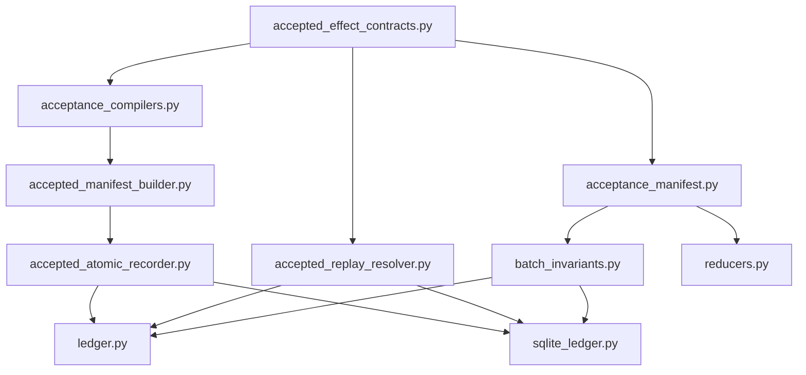

# World v2 Accepted Manifest Builder 与原子 Recorder 设计

状态：设计草案，尚未实现。

本文定义 World v2 从 production Acceptance plan 到持久化 accepted effects 的唯一授权路径。它不代表 accepted manifest 已经启用。当前 `ACCEPTED_MANIFEST_INTEGRATION_ENABLED` 必须继续保持关闭，直到本文末尾的启用门槛全部满足。

本设计**不原地扩展现有 v2 wire contract**。新写路径使用：

- manifest schema/version：`AcceptanceManifestV3` / `acceptance-manifest.3`
- effect authority schema/version：`AcceptanceAuthorizedEffectV3` / `effect-authority.1`
- durable compiler authority schema/version：`DurableEffectCompilerAuthority` / `effect-compiler-authority.1`

既有 `AcceptanceManifestV2`、`AcceptanceAuthorizedEffectV2`、其 canonical bytes、hash material、parser、reducer和replay语义全部冻结且逐字节不变。不得通过增加optional字段、改变默认值、扩展hash material或复用新resolver来“兼容升级”v2；v2只能走其原有历史读取/replay路径。本文后续的“manifest lane”若未特别注明，均指新 `acceptance-manifest.3` lane。

## 1. 目标与非目标

目标：

- 只有经过 installed compiler、可信 ProposalAudit、完整 ProjectionCursor 和 reverse verification 约束的 production plan，才能形成 accepted manifest。
- Accepted commit 必须是一个不可拆分的原子批次：`[AcceptanceRecorded, effect0, ..., effectN]`。
- SQLite 与内存 ledger 都必须对 world revision、deliberation revision 和 ledger sequence 做完整 cursor CAS。
- 重启与历史 replay 不依赖进程内 capability，也不重新调用模型或 live compiler；它仅依赖 ledger 中持久化的完整 compiler authority metadata 和已安装的历史 reverse verifier。
- Legacy Acceptance 与历史 manifest v2 继续按原字节和原语义工作，但不能与 manifest v3 authority 混用。

非目标：

- 本阶段不实现 ActionIntent、BudgetReserved 或 ActionAuthorized compiler。
- 本阶段不一次性启用所有 domain family。
- ManifestBuilder 不构造 `WorldEvent`。
- Acceptance compiler、plan DTO 和测试 registry 都不能直接写 ledger。
- Reducer 不调用模型、live compiler 或外部服务。

## 2. 核心安全原则

### 2.1 DTO 不是 capability

以下对象都是可检查的数据，不具有写入权：

- `CompiledDomainPayload`
- `AcceptedExecutionPlan`
- `AcceptanceManifestV3`
- durable compiler metadata

Production 写入链必须依赖不可序列化、不可复制且绑定 issuer 的进程内 capability：

1. `PinnedProposalAuthorityHandle`
2. `CompiledDomainAuthorityHandle`
3. `ProductionAcceptedExecutionPlanHandle`
4. `ProductionAcceptedBundleHandle`
5. `AcceptedLedgerBatchHandle`

任一层都不得接受调用者用 DTO 重建的替代对象。

### 2.2 Compiler 不拥有事件 envelope

Domain adapter 只能输出 canonical domain payload bytes。它不能决定：

- event ID
- ordinal
- causation chain
- idempotency key
- actor/source/trace/correlation
- Acceptance event envelope
- commit ID

这些字段分别由 trusted planner、ManifestBuilder 和 AtomicRecorder 统一派生。

### 2.3 Recorder 是唯一 materializer

只有 `AcceptedAtomicRecorder` 可以把 production bundle 转换成 `WorldEvent`。不得恢复以下接口：

- `PlannedEffect.to_world_event()`
- `AcceptedExecutionPlan.world_events()`
- test-only materializer
- 接收裸 DTO 的 ledger accepted 写入口

## 3. 总体流程

```mermaid
flowchart LR
    A["Trusted ProposalAuthorityReader"] --> B["PinnedProposalAuthorityHandle"]
    B --> C["Installed DomainCompilerRegistry"]
    C --> D["CompiledDomainAuthorityHandle"]
    D --> E["AcceptedEffectPlanner"]
    E --> F["ProductionAcceptedExecutionPlanHandle"]
    F --> G["AcceptedManifestBuilder"]
    G --> H["ProductionAcceptedBundleHandle"]
    H --> I["AcceptedAtomicRecorder"]
    I --> J["AcceptedLedgerBatchHandle"]
    J --> K["Ledger full-cursor CAS transaction"]
    K --> L["AcceptanceRecorded + ordered effects"]
    L --> M["Reducer projection"]
    L --> N["Commit-aware replay resolver"]
```



任何 test-scope registry 或 test-only plan 最多只能产生 inert DTO，不能进入 ManifestBuilder、Recorder 或 production ledger commit。

## 4. Production plan capability

### 4.1 缺失的 Acceptance envelope authority

当前 compilation context 已包含 acceptance event ID、world、logical time、created time、actor、source、trace 和 correlation，但还需要受信的 upstream causation：

```python
class AcceptanceCompilationContext(FrozenModel):
    acceptance_id: str
    acceptance_event_id: str
    acceptance_causation_id: str
    cursor: ProjectionCursor
    world_id: str
    logical_time: datetime
    created_at: datetime
    actor: str
    source: str
    trace_id: str
    correlation_id: str
```

`acceptance_causation_id` 必须来自触发此次 Acceptance 的真实 process/audit authority，不能由 Recorder 临时猜测。

### 4.2 ProductionAcceptedExecutionPlanHandle

Production planner 对所有 compiled handles 完成 reverse verification 后，签发：

```python
class ProductionAcceptedExecutionPlanHandle:
    @property
    def plan(self) -> AcceptedExecutionPlan: ...

    @property
    def proposal_authorities(
        self,
    ) -> tuple[PinnedProposalAuthorityHandle, ...]: ...

    @property
    def compiled_authorities(
        self,
    ) -> tuple[CompiledDomainAuthorityHandle, ...]: ...
```

约束：

- 只能由 production registry/planner issuer 签发。
- 必须绑定 world ID 和完整 cursor。
- 必须绑定 registry version/digest。
- 必须保存构建 manifest 所需的 ProposalAudit capabilities。
- 必须不可 pickle、不可 copy、不可通过公开构造器创建。
- test scope 不得签发此类型。

## 5. Durable compiler metadata

进程内 handles 在重启后不存在，因此每个 domain effect 必须把完整 compiler authority 持久化到 manifest。只保存 `compiler_ref` 或单个 digest 不足以支持历史验证。

应在中立模块 `accepted_effect_contracts.py` 定义唯一 canonical authority。下列字段是 wire contract，不允许由模糊的 `dependency_digests` 代替：

```python
class TypedCompilerDependencyV1(FrozenModel):
    dependency_kind: Literal[
        "proposal_schema",
        "payload_schema",
        "policy_contract",
        "hash_contract",
        "canonicalizer",
        "domain_authority",
    ]
    dependency_ref: str
    dependency_digest: str


class DurableEffectCompilerAuthority(FrozenModel):
    authority_version: Literal["effect-compiler-authority.1"]
    install_descriptor_ref: str
    install_descriptor_digest: str
    registry_version: str
    registry_ref: str
    registry_digest: str
    compiler_key: DomainCompilerKey
    compiler_ref: str
    compiler_digest: str
    reverse_verifier_ref: str
    reverse_verifier_digest: str
    canonical_codec_ref: str
    canonical_codec_digest: str
    output_contract_ref: str
    output_contract_digest: str
    resolver_ref: str
    resolver_digest: str
    predicate_matrix_ref: str
    predicate_matrix_digest: str
    evidence_use_matrix_ref: str
    evidence_use_matrix_digest: str
    privacy_matrix_ref: str
    privacy_matrix_digest: str
    observation_authority_contract_ref: str
    observation_authority_contract_digest: str
    event_catalog_ref: str
    event_catalog_digest: str
    domain_identity_contract_ref: str
    domain_identity_contract_digest: str
    reducer_bundle_ref: str
    reducer_bundle_digest: str
    typed_dependencies: tuple[TypedCompilerDependencyV1, ...]
    proposal_event_ref: str
    proposal_event_payload_hash: str
    proposal_hash: str
```

约束：

- 每个核心artifact都必须同时持久化语义稳定的ref与exact digest；只有ref或只有digest都不完整。
- Fact sealed install descriptor中的字段必须与本authority同名语义逐项对齐；`install_descriptor_ref/digest`绑定整份descriptor，其余字段绑定descriptor中的独立artifact，形成可独立验证的Merkle-like明细而不是只信一个总digest。
- `typed_dependencies` 按 `(dependency_kind, dependency_ref)` 排序，该二元组唯一，且数量和总字节有上限。
- 禁止 `dependency_digests`、`extras`、自由字符串map或“其他依赖”作为兜底；新增依赖类别必须先版本化 `TypedCompilerDependencyV1` 或发布新的authority schema。
- domain专属policy可使用 `policy_contract` typed dependency，但不能替代显式的predicate、evidence-use、privacy matrices。
- 所有 digest 必须为 exact lowercase SHA-256。
- `compiler_key` 精确绑定 proposal schema registry、change kind/transition、payload schema/version。
- authority必须与sealed install descriptor逐字段完全相等；registry、compiler、reverse verifier、canonical codec/output contract、resolver、三类matrix、observation authority contract、event catalog、domain identity contract、reducer bundle及typed dependencies缺一即unsupported。
- 某domain确实不使用某类matrix时，也必须绑定registry中sealed、带版本和digest的`not-applicable` contract artifact；不能用空串、`None`或省略字段表达。
- `proposal_event_ref/payload_hash/proposal_hash` 必须与 manifest proposal summary 一致。
- metadata 本身必须纳入 manifest hash。
- 同一个 effect 不允许同时携带两个互相矛盾的 compiler authority。

新 `AcceptanceAuthorizedEffectV3` 的 domain mutation role 必须要求该metadata；不得修改或复用 `AcceptanceAuthorizedEffectV2`：

```python
class AcceptanceAuthorizedEffectV3(FrozenModel):
    effect_authority_version: Literal["effect-authority.1"]
    ordinal: int
    role: AuthorizedEffectRole
    event_id: str
    event_type: str
    payload_hash: str
    authority_refs: tuple[EffectAuthorityRefV3, ...]
    domain_compiler_authority: DurableEffectCompilerAuthority | None
```

Role contract：

- `domain_mutation`：必须有且仅有一个 change authority ref，并携带 domain compiler authority。
- `action_authorization`：不得冒用 domain compiler authority；未来使用 action compiler metadata。
- `budget_reservation`：不得冒用 domain compiler authority；未来使用 budget planner metadata。

为避免 `acceptance_manifest.py` 与 `acceptance_compilers.py` 循环依赖，authority refs、durable metadata 和纯 batch DTO 应共同放入 `accepted_effect_contracts.py`。

`AcceptanceManifestV3.manifest_version` 必须严格等于 `acceptance-manifest.3`，其 canonical encoder、hash domain separation和parser均为新入口。v3 parser不得接受v2后补字段，v2 parser也不得接受v3；跨版本转换只能产生显式migration event，不能在decode时隐式upcast并重算历史hash。

## 6. ManifestBuilder

### 6.1 接口

```python
class AcceptedManifestBuilder:
    def build(
        self,
        plan: ProductionAcceptedExecutionPlanHandle,
    ) -> ProductionAcceptedBundleHandle: ...
```

Builder 不接受 `AcceptedExecutionPlan`、test-only handle 或裸 compiled payload。

### 6.2 构建步骤

1. 验证 plan handle issuer 和 production scope。
2. 验证 world ID、完整 cursor 和 registry version/digest。
3. 对所有 compiled authority handles 再做 strict revalidation 和 registry reverse verification。
4. 通过 pinned ProposalAudit 重新推导 `AcceptanceManifestProposalV3`。
5. 按 `proposal_id` canonical 排序，拒绝重复 proposal。
6. 将每个 planned effect 映射为一个 `AcceptanceAuthorizedEffectV3(effect_authority_version="effect-authority.1")`。
7. 验证 ordinal 连续、event identity 唯一、authority 三元 identity exact-once。
8. 验证每个 effect 的 durable compiler metadata 与 installed registry descriptor 完全相等。
9. 计算 canonical manifest hash。
10. 签发 `ProductionAcceptedBundleHandle`。

### 6.3 ProductionAcceptedBundleHandle

Bundle handle 至少绑定：

- manifest value
- production plan handle
- acceptance envelope authority
- world ID
- full pre-commit cursor
- registry version/digest
- exact ordered effect digest
- bundle digest

Bundle digest 应使用独立 domain separation，例如：

```text
accepted-bundle.1(
  world_id,
  full_cursor,
  acceptance_event_id,
  manifest_hash,
  ordered_effect_digest,
  registry_digest
)
```

Builder 仍然不构造 `WorldEvent`。

## 7. AcceptedAtomicRecorder

### 7.1 接口

```python
class AcceptedAtomicRecorder:
    def commit(
        self,
        bundle: ProductionAcceptedBundleHandle,
    ) -> CommitResult: ...
```

Recorder 必须持有：

- trusted ledger port
- production ManifestBuilder capability
- installed compiler registry capability
- trusted ProposalAuthorityReader
- accepted ledger capability issuer

### 7.2 Commit 前验证

Recorder 必须：

1. 验证 bundle issuer，拒绝 DTO、test scope 和跨 registry handle。
2. 读取 ledger 当前完整 cursor，要求与 plan cursor完全相等。
3. 按 plan cursor 重新读取所有 ProposalAudit。
4. 验证 ProposalAudit 对应的真实 `ProposalRecorded` ledger event/type/world/payload hash/commit cursor。
5. 对每个 compiled authority再次调用 registry reverse verifier。
6. 重新调用 ManifestBuilder，要求重建 manifest 和 bundle digest完全一致。
7. 重新验证 payload typed decode → model dump → canonical encode 与原始 bytes完全一致。

### 7.3 唯一 materialization

验证通过后，Recorder 才能构造：

```text
events[0] = AcceptanceRecorded(manifest)
events[1] = planned effect ordinal 0
events[2] = planned effect ordinal 1
...
```

Acceptance event：

- event ID 等于 plan 中预绑定 acceptance event ID。
- causation ID 等于受信 `acceptance_causation_id`。
- trace/correlation/world/time/actor/source 等于 context。
- idempotency key 使用 `acceptance-manifest.3` identity contract；不得复用v2 hash domain。

Effect event：

- event ID、event type、payload bytes/hash 等于 planned effect。
- ordinal 0 的 causation ID 是 Acceptance event ID。
- ordinal n 的 causation ID 是 effect n-1 的 event ID。
- domain idempotency key 必须等于 machine `domain_idempotency_key`。

### 7.4 Commit identity

Commit ID 必须确定性绑定：

- world ID
- full pre-commit cursor
- manifest hash
- exact ordered event-envelope hash
- registry digest

同一 commit ID 的重试仅允许完全相同 bytes；不同 bytes 必须产生 `IdempotencyConflict`。

## 8. Ledger accepted capability 与 full-cursor CAS

### 8.1 普通 commit 必须 fail closed

现有 `LedgerPort.commit()` 如果发现 batch 中包含 status=accepted 的 manifest v3，必须拒绝：

```text
accepted_manifest.recorder_capability_required
```

即使调用者构造了形状正确、hash正确的 manifest，也不能绕过 Recorder。

### 8.2 新 accepted commit seam

```python
class LedgerPort(Protocol):
    def commit_accepted(
        self,
        batch: AcceptedLedgerBatchHandle,
        *,
        expected_cursor: ProjectionCursor,
    ) -> CommitResult: ...
```

`AcceptedLedgerBatchHandle` 由 Recorder 签发，绑定：

- recorder issuer
- world ID
- full pre-cursor
- manifest hash
- exact ordered batch hash
- commit ID
- event count

它不可序列化、不可复制，不能替换 events。

### 8.3 完整 cursor CAS

Accepted commit 必须同时比较：

- `world_revision`
- `deliberation_revision`
- `ledger_sequence`

仅比较 world revision 不足以表达 exact snapshot authority。

SQLite 顺序：

1. `BEGIN IMMEDIATE`
2. 验证 batch capability 与 exact event bytes
3. 读取 head
4. full-cursor CAS
5. batch invariants
6. reducer staging
7. events/commit/head 原子写入
8. commit

任一步失败必须 rollback，不能留下 Acceptance 或部分 effects。

Recorder 在事务外做 reverse verification不会产生可利用的 TOCTOU：reverse verifier读取的是不可变历史 cursor；如果 head 在此后变化，事务内 full-cursor CAS 必须失败。

内存 ledger 必须执行相同的 capability、batch hash 和 full-cursor CAS 检查。

## 9. Exact batch invariants

`validate_commit_batch` 应增加 accepted-authorized 调用上下文。没有 ledger capability 时，accepted v3 batch一律失败。

### 9.1 Accepted v3

必须满足：

```text
events == [AcceptanceRecorded, effect0, effect1, ..., effectN]
len(events) == 1 + len(manifest.authorized_effects)
```

逐 effect 验证：

- `event[i + 1].event_id == manifest.effects[i].event_id`
- event type 相等
- payload hash 相等
- ordinal 等于 i
- authority refs 完全相等
- durable compiler metadata完整且与 effect/proposal一致
- effect event revision class 为 world
- domain mutation能被 installed typed family decode/bind
- typed mutation proposal/change/revision/hash与manifest authority一致

禁止：

- 漏 effect
- 多 effect
- 重排
- 额外 Acceptance
- ProposalRecorded/ModelResultRecorded 混入
- legacy Acceptance 混入
- 同一 authority 三元 identity 被使用两次，即使hash不同
- manifest effect event ID重复

### 9.2 Rejected/stale v3

保持当前语义：

- commit 中只能有一个 AcceptanceRecorded。
- `authorized_effects` 必须为空。
- rejected evaluated revision 必须等于当前 world revision。
- stale evaluated revision 必须早于当前 world revision。

### 9.3 Legacy batch 隔离

无 `manifest_version` 的 legacy Acceptance 继续使用原有单proposal、单mutation、邻接规则。`acceptance-manifest.2` 进入冻结的v2 validator/reducer/replay，不进入本设计的v3 validator，也不得被重新编码。

现有 legacy invariant 循环必须排除 versioned manifest 管辖的 effect indices，否则会错误寻找 legacy `accepted_change_id/hash`；v2和v3的effect indices分别由各自版本validator管理。

领域闭环仍独立保留：

- Appraisal trigger completion
- settlement 到 appraisal trigger
- occurrence-backed Experience pairing

这些闭环中的 Acceptance authority 查询需要同时支持 legacy lane、冻结v2 lane和manifest v3 lane，但不得把领域闭环塞入通用 compiler authority validator。

## 10. Reducer 双 lane

### 10.1 为什么不能复用现有 lane

当前许多 reducer 要求：

- persisted legacy typed proposal projection
- `acceptance_decisions[-1]`
- 上一个 committed event 是 AcceptanceRecorded
- mutation payload等于 legacy proposal内嵌的完整 proposed mutation

这些假设与 multi-effect manifest v3 冲突：

- 只有 effect0 紧跟 Acceptance。
- ProposalEnvelope v2 被保存为 ProposalAudit，不会生成 legacy `*ProposalProjection`。
- 一个 manifest 可以授权多个 proposal/change。

### 10.2 Legacy lane

Legacy helper 保持现状，处理无 `manifest_version` 的 Acceptance。不要为了v3删除legacy replay能力。版本dispatcher还必须把 `acceptance-manifest.2` 路由到原封不动的v2 helper；该helper及其输入bytes/hash/replay golden不得因v3上线而变化。

### 10.3 Manifest v3 lane

新增共享 helper，概念接口如下：

```python
def require_manifest_effect_authority(
    state: ReducerState,
    event: WorldEvent,
    typed_binding: AcceptedMutationBinding,
) -> ManifestEffectAuthority: ...
```

它必须验证：

- current event ID 在最近相关 accepted manifest 中只出现一次。
- event type/payload hash匹配 manifest effect。
- typed binding 的 proposal ID/change ID/revision/hash匹配 authority ref和proposal summary。
- durable compiler metadata指向同一个 ProposalAudit event/hash/proposal hash。
- ordinal 0 的前一 committed ref是 manifest Acceptance event。
- ordinal n 的前一 committed ref是同manifest effect n-1。
- effect未被重复消费。

Manifest lane 不查 legacy typed proposal projection，也不伪造 legacy proposal。Domain payload模型继续负责验证：

- before/after image
- expected entity revision
- evidence/policy bindings
- compensation lineage
- semantic fingerprint与domain mutation hash

Compiler reverse verifier在 commit/replay boundary证明 TypedChange 到完整 domain payload 的转换；reducer负责确定性应用已验证事件。

### 10.4 Acceptance reducer

Accepted manifest reducer必须：

- 只在 ledger accepted capability路径可达。
- 重新绑定 ProposalAudit summaries。
- 保存新的 `AcceptanceManifestRefV3`，包括canonical durable compiler metadata；不得给 `AcceptanceManifestRefV2` 增加字段。
- 写入 manifest-aware decision refs。
- 不填充伪造的 legacy `accepted_change_id/hash`。
- 不把 manifest v3 decision交给legacy或v2 mutation helper。
- 保留 immutable ProposalAudit；decision防止 proposal再次accept。

## 11. Replay resolver

### 11.1 接口

```python
class HistoricalAuthorityView(Protocol):
    @property
    def cursor(self) -> ProjectionCursor: ...

    def lookup_source_event(self, event_ref: str) -> HistoricalEventRecord: ...
    def require_payload_hash(self, event_ref: str, payload_hash: str) -> None: ...
    def revision_at(self, event_ref: str) -> HistoricalEventRevision: ...
    def proposal_audit(self, proposal_id: str) -> ProposalAuditProjection: ...


class AcceptedEffectReplayResolver:
    def verify_commit(
        self,
        *,
        events: tuple[WorldEvent, ...],
        pre_cursor: ProjectionCursor,
        historical_authority_view: HistoricalAuthorityView,
        pre_state: ReadOnlyReducerState,
    ) -> None: ...
```

`HistoricalAuthorityView` 必须只由当前commit之前的持久化ledger prefix `[0, pre_cursor.ledger_sequence]` 构造，并固定到完全相同的world/deliberation revision。它提供source event lookup、原始payload hash核验以及该source在历史prefix中的revision/sequence；`pre_state`必须是同一prefix投影出的只读快照。两者的cursor不相等时resolver必须拒绝。

Resolver 通过完整 durable metadata 查找 deterministic verifier。lookup key覆盖canonical authority中所有显式artifact refs+digests以及typed dependencies；不能缩减成一个无类型dependency集合。概念主键为：

```text
(authority_version,
 install_descriptor_ref/digest,
 registry_ref/digest,
 compiler_ref/digest,
 reverse_verifier_ref/digest,
 canonical_codec_ref/digest,
 output_contract_ref/digest,
 resolver_ref/digest,
 predicate_matrix_ref/digest,
 evidence_use_matrix_ref/digest,
 privacy_matrix_ref/digest,
 observation_authority_contract_ref/digest,
 event_catalog_ref/digest,
 domain_identity_contract_ref/digest,
 reducer_bundle_ref/digest,
 typed_dependencies)
```

它可以解析 current 或 archived verifier，但必须 exact digest match。

### 11.2 Replay 规则

- 只运行 reverse verifier，不运行 compiler。
- 不调用模型、网络、工具或随机源。
- resolver、reverse verifier和authority reader只能读取`HistoricalAuthorityView`与`pre_state`；禁止读取ledger live head、当前projection、当前revision或任何post-commit event。
- 每个proposal/source/evidence/observation ref都必须通过historical view定位，核验原始event type、payload hash、world ID、ledger sequence及其历史revision；不得从manifest自报summary直接视为已验证。
- 不根据当前最新代码“尽力解释”历史 payload。
- 未安装历史 verifier/digest时 hard fail，要求安装历史包或显式迁移。
- 实际 persisted event bytes必须匹配manifest effect和output contract。
- ProposalAudit必须按 manifest 中 event ref/hash/proposal hash精确解析。

### 11.3 Commit-aware replay

SQLite 当前主要按 ledger sequence逐row replay，不足以重新验证原子 accepted batch。需要按 persisted `commit_id` 分组：

1. 验证 commit request hash。
2. 恢复 pre-commit cursor。
3. 从该prefix构造只读 `HistoricalAuthorityView` 与 `pre_state`，并验证二者cursor均等于pre-commit cursor。
4. 对整组调用对应manifest版本的batch invariants。
5. 对accepted v3组调用新replay resolver；历史v2组继续走冻结v2 replay入口。
6. 验证通过后逐event reduce。

内存 ledger 的 `_StoredEvent` 也需要记录 commit ID或等价commit boundary，使 `project_at` 能执行相同验证。

SQLite 对旧 Acceptance 的兼容降级规则必须保持隔离：

- 无manifest_version的旧 Acceptance 在历史条件不足时可按既有规则迁移为 `LegacyAcceptanceAuditRecorded`。
- `acceptance-manifest.2` 必须按原始v2 bytes/hash/replay规则处理，不能upcast成v3或补齐新authority metadata。
- 任何带manifest_version的事件验证失败都必须 hard fail，绝不能降级成legacy audit；v3也绝不能降级成v2。

## 12. 依赖与文件改动图



### 12.1 新文件

- `src/companion_daemon/world_v2/accepted_effect_contracts.py`
  - durable compiler authority
  - pure batch/bundle摘要 DTO
  - 不依赖 ledger、reducers或adapter
- `src/companion_daemon/world_v2/accepted_manifest_builder.py`
  - production plan capability到bundle capability
  - 不materialize WorldEvent
- `src/companion_daemon/world_v2/accepted_atomic_recorder.py`
  - 唯一 WorldEvent materializer
  - accepted batch capability issuer
- `src/companion_daemon/world_v2/accepted_replay_resolver.py`
  - current/archived reverse verifier resolution
- 对应 targeted tests

### 12.2 修改文件

- `acceptance_compilers.py`
  - production plan handle
  - acceptance upstream causation
  - 使用中立 durable metadata
  - 继续保持 inert
- `acceptance_manifest.py`
  - 新增 `AcceptanceManifestV3` / `AcceptanceAuthorizedEffectV3`，不修改v2 wire models
  - v3 effect durable metadata
  - commit/replay内部accepted结构验证入口
  - public accepted parser gate继续关闭
- `batch_invariants.py`
  - exact accepted batch
  - legacy/冻结v2/新v3严格分流
- `ledger.py`
  - accepted capability commit
  - full cursor CAS
  - commit-aware in-memory replay
- `sqlite_ledger.py`
  - 事务内 capability + full cursor CAS
  - commit-aware replay
- `reducers.py`
  - accepted v3 Acceptance reducer
  - domain mutation manifest v3 lane
  - 保持v2 reducer bytes/hash/replay golden不变
- `event_catalog.py`
  - 将 payload shape validation 与 accepted write authorization分离
  - 不能因此公开 accepted ledger入口
- `schemas.py`
  - 仅当现有 manifest ref/decision ref不能表达必要lineage时小幅扩展
- `typed_proposal_families.py`
  - 仅当 batch/reducer需要公共 typed mutation binding接口时小改

## 13. TDD 实施顺序

每一步都先写 public seam 测试，再写最小实现。

### Slice 1：Durable metadata

- canonical roundtrip
- 每个显式artifact ref/digest缺失、错配或tamper
- typed dependency kind/ref/digest重复、乱序、未知kind、超限和metadata总量放大
- 无类型`dependency_digests`、自由map和兜底字段拒绝
- 缺字段、alias、默认值省略
- hostile `model_construct`
- public accepted parser仍然关闭

### Slice 1A：版本冻结与新wire contract

- v2历史fixtures的canonical bytes与hash逐字节golden不变
- v2 parser/reducer/replay结果不变，且拒绝v3字段
- v3严格要求`acceptance-manifest.3`和`effect-authority.1`
- v3 parser拒绝v2补字段、未知版本和隐式upcast
- v3使用独立hash domain，无法伪装成v2

### Slice 2：Production plan capability

- DTO不能进入Builder
- test plan不能进入Builder
- 跨registry issuer拒绝
- 缺acceptance upstream causation拒绝
- copy/pickle/model_construct攻击

### Slice 3：ManifestBuilder

- ProposalAudit重新推导
- proposal canonical排序
- effect ordinal/id/type/hash映射
- authority exact-once
- canonical durable metadata全部显式refs+digests及typed dependencies与sealed registry descriptor完全绑定
- manifest hash tamper
- Builder不产生WorldEvent

### Slice 4：Exact batch invariants

- 正确 `[AcceptanceRecorded, effects]` shape
- 漏项、额外项、重排
- 错event ID/type/payload hash
- duplicate authority，包括同identity不同hash
- mixed legacy/v2/v3及跨版本effect
- rejected/stale仍为单事件
- 无ledger capability的accepted batch拒绝

### Slice 5：Recorder materialization

- 只有production bundle可materialize
- Acceptance envelope完整绑定
- effect causation chain
- machine idempotency identity
- deterministic commit ID
- bundle重建不一致拒绝

### Slice 6：内存 ledger capability 与 CAS

- 普通commit accepted拒绝
- stale world revision
- stale deliberation revision
- stale ledger sequence
- stolen capability
- capability绑定另一batch
- 相同commit ID不同bytes
- 原子rollback/无部分写

### Slice 7：SQLite transaction

- 与内存 ledger 相同的攻击矩阵
- `BEGIN IMMEDIATE` 内full cursor CAS
- crash/异常 rollback
- duplicate event/idempotency/commit冲突
- 并发两个Recorder只有一个成功

### Slice 8：第一个真实 domain vertical

建议先实现 `fact_transition:commit → FactCommitted`：

- sealed production install manifest
- exact compiler descriptor
- reverse verifier
- Manifest reducer lane
- Fact reducer manifest v3 lane；冻结v2 lane不改
- recorder E2E
- SQLite restart/replay

其余 compiler key继续explicit unsupported。

### Slice 9：Replay

- current verifier digest
- archived verifier digest
- unknown digest hard fail
- `HistoricalAuthorityView` 与`pre_state`只由pre-commit prefix构造且cursor一致
- source event lookup/hash/revision/sequence正确，越过pre-cursor的source拒绝
- resolver、verifier或reader尝试读取live head/current projection时拒绝
- 同一历史commit在live head继续增长后仍产生完全相同的replay结果
- proposal event tamper
- effect bytes tamper
- commit boundary tamper
- legacy downgrade隔离、v2冻结replay隔离、v3不得降级v2
- historical `project_at` 与重启结果一致

### Slice 10：逐 family 扩展

按 domain逐个增加 compiler、reducer lane、attack tests与replay golden。禁止一次性翻全局开关。

## 14. 启用门槛

### 14.1 基础设施门槛

- ManifestBuilder只接受production plan capability。
- Recorder是唯一materializer。
- 普通ledger commit无法提交accepted v3。
- 内存与SQLite都实现full-cursor CAS。
- exact batch invariant覆盖重排、漏项、额外项和tamper。
- `AcceptanceManifestV3` / `effect-authority.1` 已使用独立的新parser、encoder与hash domain；v2 canonical bytes/hash/parser/reducer/replay golden全部不变。
- canonical durable compiler authority显式绑定sealed install descriptor、compiler、reverse verifier、canonical codec/output contract、resolver、predicate/evidence/privacy matrices、observation authority contract、event catalog、domain identity、reducer bundle、registry及typed dependencies；无untyped dependency兜底。
- durable compiler metadata可完整replay。
- unknown historical verifier hard fail。
- replay只使用pre-commit prefix构造的只读`HistoricalAuthorityView`/`pre_state`，能够复核source event/hash/revision，且代码路径无法读取live head。
- legacy、冻结manifest v2与新manifest v3测试完全隔离。
- SQLite restart、project_at和并发测试通过。

### 14.2 Proposal 级局部启用

一份 proposal 只有在以下条件全部满足时才可accepted：

- 每个 proposed change都有installed production compiler。
- 每个 action intent都有对应production action/budget compiler；未实现前，含action intent的proposal不得accepted。
- 所有 compiler都属于同一个installed registry manifest。
- 所有 ProposalAudit都由trusted reader按同一完整cursor pin住。
- 所有 compiled effects reverse verification通过。
- Builder和Recorder能重建完全相同manifest/batch digest。
- 所有涉及的reducers已实现manifest v3 lane，且v2 lane未发生字节、hash或语义变化。
- 所有涉及的historical reverse verifiers已进入replay resolver。
- 所有resolver所需source authority都能从同一pre-commit historical view解析；任何仅存在于live head的source都必须拒绝。

### 14.3 全局启用

只有当 proposal schema registry 中所有允许进入 production deliberation 的 change/action kind都达到完整coverage，并完成长期replay、v2冻结回归与迁移测试后，才可以考虑改变全局accepted v3 parser gate。v2 parser不因该开关改变语义。

在此之前应采用局部、capability控制的启用方式：

- unsupported key整份proposal fail closed
- partial compilation整份proposal fail closed
- test registry永远不能写production ledger
- 不得用“manifest shape有效”冒充“accepted integration已完成”

## 15. 完成定义

本设计的完成不是“accepted parser能够解析 accepted status”，而是：

1. Proposal authority来自真实、cursor-pinned ledger audit。
2. Compiler authority由sealed production registry决定。
3. Manifest完整、持久地记录compiler/reverse/output/dependency authority。
4. Recorder独占materialization。
5. Ledger在一个事务内完成capability验证、full-cursor CAS和整个batch写入。
6. Reducer通过版本dispatcher在legacy语义lane与versioned manifest语义lane中确定性应用事件；manifest内部冻结v2并独立运行新v3实现。
7. Replay能仅凭持久化bytes和历史verifier重建相同projection。
8. 任一缺失、未知、陈旧、重排或tamper都fail closed且零部分写。

满足这些条件后，才能把某一个已覆盖 domain vertical称为“accepted 已接入”。
