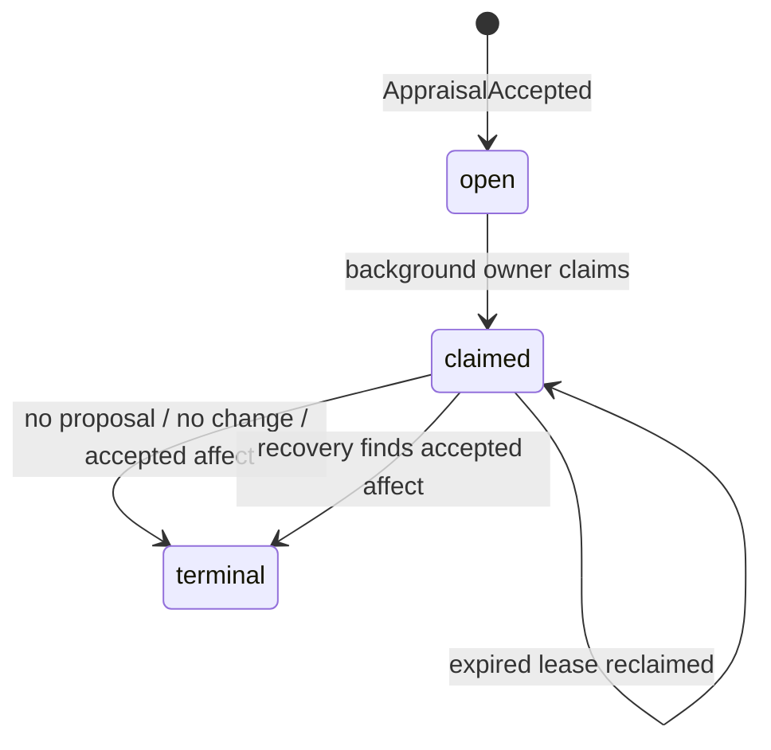

# Affect deliberation trigger runtime

## Intent

An accepted Appraisal may justify a later Affect change, but it must never
block the user-visible reply.  `affect_deliberation` is therefore a durable,
low-priority process, not an inline reaction rule.

Its input is exactly one committed `AppraisalAccepted` event.  The model may
choose `no_change` or propose a typed Affect transition; the model cannot
invent a second appraisal source.

## State machine

The trigger id is a hash of `(world_id, appraisal_event_id)`.  It binds the
source evidence reference, so retries cannot be redirected to another
conversation turn.

## Recovery ordering

`AffectTriggerRuntime.drain_one()` takes one non-terminal trigger and:

1. Resolves and verifies its exact `AppraisalAccepted` source event.
2. Checks whether an accepted typed Affect proposal already descends from the
   source Decision audit. If yes, it records only `TriggerProcessCompleted`.
3. Keeps an active lease only for its owner; otherwise it waits until expiry,
   then records a new `TriggerProcessReclaimed` attempt.
4. Delegates to `AffectDeliberationWorker`, which reuses a persisted generic
   Decision audit or pending typed candidate before it calls the model.
5. Completes the claimed trigger with the durable outcome.

Thus each failure boundary is recoverable:

| Durable state after failure | Next run |
| --- | --- |
| no generic audit | one fresh model deliberation |
| generic Decision audit only | compile it; no model call |
| typed Affect candidate only | accept it; no model call |
| accepted Affect batch | complete trigger; no model call |
| terminal trigger | no-op |

## Hosting boundary

`WorldRuntime.ingest()` only opens/claims the trigger after an Appraisal is
accepted. A host invokes `await runtime.drain_background_once()` from its
worker loop. This preserves the fast reply path while retaining a single
World v2 ledger and lease protocol; no QQ-specific code participates.

The worker uses the current projection cursor, whereas every causal source
remains an exact immutable ledger event reference. A `ConcurrencyConflict`
is intentionally retried by the host loop rather than broadening authority or
silently overwriting a newer world state.
