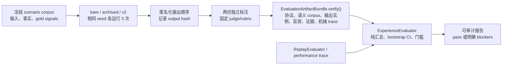

# World v2 人味评估器：可复现的体验证据，而非自动“判人类”

状态：实施中（Phase 8）
权威规格：[World v2 重构计划](../world-v2-refactor-plan.md) §9；术语以 `CONTEXT.md` 为准。

## 目的与边界

`ExperienceEvaluator` 是一个只读、确定性的报告编译器。它接收固定场景、匿名运行产物、独立评审和机械完整性结果，输出版本化的比较报告。它**不会**：

- 调用模型、QQ、provider 或世界运行时；
- 根据词汇多样性推断“像人”；
- 写入 Affect、Relationship、Memory、Action 或任何 World Event；
- 把“安慰”当作对失望、冒犯或关系张力的唯一正确反应；
- 在缺少外部评审或基线时给出通过结论。

因此它和 `ReplayEvaluator` 是互补关系：后者证明账本/Action/replay 的机械因果正确；前者证明在同一输入条件下，候选版本没有因机制变复杂而损失对当下、潜台词、主观性和长期连续性的体验质量。



## 输入合同

每次评估固定以下版本和证据，任何一项改变即是新 baseline：

| 对象 | 必填内容 | 防止的错误 |
|---|---|---|
| `EvaluationProtocol` | scenario/rubric/judge/statistics 版本、固定 judge ID、temperature=0、bare/archive/v2、3 次 seed | 偷换 prompt、模型或统计方法后沿用旧结论 |
| `ScenarioTurn` | immutable input/fact hash、场景族、是否 emotion gold、多个可接受的察觉 tag | 用 120 条普通闲聊凑数；把安慰写成唯一答案 |
| `ReviewedRun` | variant、turn、seed、与 `ScenarioTurn` 相等的 input/fact hash、匿名 output hash、评审者、rubric score、观察到的 response tag | 把不同输入或事实条件下的输出伪装成可配对样本 |
| `EvidenceArtifact` | output/Proposal/AffectEpisode 的 artifact hash、reference、其绑定的 output hash | 用任意字符串/tag 将情绪察觉计为命中 |
| `MechanicalEvaluation` | replay hash、Action leak、hard invariant、Affect 错误清零、draw consistency、hot latency | 文风好看却有世界事实或延迟回归 |

### 已验证工件 bundle

正式协议不能把上表的 hash 当作彼此无关的字符串传给评估器。边缘 adapter 必须先构造
`EvaluationArtifactBundle`；`ExperienceEvaluator` 对 `human-likeness-eval-v1` 只接受该
bundle，并在内部调用唯一的验证 seam `verify()`。调用者不能直接传入可手工构造的
`VerifiedEvaluationArtifacts`。

- `ProtocolIdentity` 还包含完整评估合同的 hash：variants、重复次数、coverage、judge、温度和两份盲测 manifest；因此不能换 judge 或降低样本要求后沿用旧工件。
- `ScenarioCorpusEntry` 固定场景 ID/family、emotion-gold、允许 tag、输入与事实 hash；不能仅保留文本输入而改写 recall 的评分语义。
- `CapturedScenarioOutput` 和 `BlindPresentation` 都以 `(variant, turn, seed)` 为身份，而非仅以文本 hash；不同运行恰好生成同一句话仍是两个独立盲测实例。
- bundle 同时重算 blinded-order 与 unblinding-map digest，必须与 `EvaluationProtocol` 声明的两个 digest 完全相同。
- 每个 output/Proposal/Affect 的 `EvidenceArtifactCapture` 同时绑定 source/reference、输出实例、输出 hash 与 artifact hash；评审传入的 evidence manifest 必须与 bundle 精确相等。
- `MechanicalTraceEvidence` 同时固定六份原始 trace hash 和由 trace 导出的 failure/consistency/latency 数值；`MechanicalEvaluation` 任一数字或 hash 不一致都会成为 blocker。随机 draw 另有 `installed`、`not_applicable`、`missing_required` 三态，不能把未安装 authority 的空集合伪装成 100% 一致；fixture 明确要求 draw 而缺证据时必须阻断。

bundle 证明的是**本地输入工件之间的完整绑定**，不是对外部文件来源的神奇担保。生产
adapter 仍须从只读 fixture/replay/receipt/performance exports 重算这些 hash，并将其纳入受版本控制的评估产物；不能手工填写 digest 后宣称验收通过。

一个 `(variant, scenario_turn, seed)` 有且仅有一份输出 hash，可有多份独立 reviewer record。两个 reviewer 不一致是数据，不可被最后写入的一条覆盖。所有 variant 的 `(turn, seed)` 集合和每单元 reviewer panel 都必须完全相同；每项指标先聚合到该单元，再做版本比较，不能靠对某个命中样本增加 reviewer 来提高 recall。

## 场景矩阵

正式 `human-likeness-eval-v1` 必须至少有 120 个唯一 scenario-turn，其中至少 40 个 emotion-gold；每个 bare/archive/v2 都在相同输入事实下以 3 个 seed 运行。首批 corpus 至少覆盖：

| 场景族 | 要观察的不是固定台词，而是 |
|---|---|
| `ordinary_share` | 当下输入优先、自然停顿、非客服式好奇 |
| `question_loop` | 不把每一回合都做成追问 |
| `mild_disappointment` | 察觉失望或给空间，不机械赔罪 |
| `explicit_offence` | 合理的不高兴、边界、反驳或收住 |
| `subtext_sarcasm` | 不把潜台词臆断成事实 |
| `hurt_residue` | 表面缓和后 episode 不被错误清零 |
| `distant_relationship` | 察觉但可选择不干预 |
| `repair` | 自主修复而非取悦性服从 |
| `npc_world_impact` | NPC/处境对语气有影响但不冒充外部事实 |
| `plan_change` / `procrastination` | 计划、承诺、拖延的世界连续性 |
| `reply_later` / `interruption` | 延迟回复兑现，插话能取消过期表达 |
| `multi_segment` / `media_opportunity` | 多段输入与媒体机会不抢走当前对话 |
| `provider_timeout` / `projection_gap` | fallback 仍自然，且不伪造发生过的事 |

情绪 gold 的通过条件是 output、Proposal 或持久 `AffectEpisode` 至少一项有证据地响应一个允许 tag，且没有把竞争性解释断言为事实。它允许“我看见了但此刻不安慰”。

### 离线机制回归（不是盲评）

`world-v2-scenario-corpus.3` 冻结 120 个 scenario-turn（49 个 emotion-gold）和其可执行脚本 hash。所有条目绑定输入、事实和脚本；其中 `npc_world_impact.01` 经应用层 `tick → commit_occurrence → record_outcome_observation → restart → outcome settlement → NPC appraisal → Affect` 建立并消费 sidecar-backed 私有 occurrence，下一轮 Context 同时验证 outcome 与 Affect 可见。`plan_change.01` 经应用层的 source-bound `plan_activity` 命令写入真实 `ActivityPlanned`；`reply_later.01` 物化一个 immediate beat 与一个有 dependency/delay window 的 beat，先将后者标记 scheduled，再由新输入打开并完成 `expression_reconsideration`，只有 Logical Clock 到期后才经 ActionPump/receipt 结算。它们是固定 fake 模型下的 authority/replay 回归，不等于模型已经能可靠自主选择生活计划或自然延迟。`interruption.01` 与 `media_opportunity.01` 在旧 Action dispatch 前插话，`projection_gap.01` 则明确断言 preview 不会越权出现在普通聊天路径。其余条目仍是小型单轮 control，避免为了凑“多回合”把不必要的历史强加给每一个 gold 输入。

`ScenarioRunner` 用固定 fake Flash 模型和固定 fake provider，为每项建立独立 SQLite World v2，只通过 `WorldV2TurnApplication` 的 ingress、clock、occurrence、outcome、ActionPump 和 replay-export seam 执行；它不会直接调用 reducer 或写 ledger。每个 fixture 同时冻结 required/forbidden event 谓词、required trigger kind、输入/事实/script hash，并验证 effect-once、provider failure/unknown、dispatch 前重启恢复、replay hash 及 `test-economy-v1` 的每个用户 turn 一次主模型调用上限。插话 fixture 进一步要求 Action 顺序精确为“旧 action 仍 gated、新 action delivered”，避免旧内容先发、再把新内容挂起的伪通过。runner 还会从 application 导出的不可变 projection 编译只读 Room view，断言 seeded private occurrence/result/location 和 preview/recipient 字符串都不泄露。`media_opportunity.01` 的**当前**断言是“插话不会自动交付 preview”；完整 render/inspection/preview 的 provider contract 仍由 Media v2 lifecycle suite 覆盖，不能把这个 chat fixture 误报为图片生成闭环。

CI 通过 `scripts/verify_world_v2_scenarios.py` 导出版本化 manifest。该产物只能作为机制回归证据，**绝不**代替 bare/archive/v2 的三 seed 输出、匿名化、两份独立评审或正式 `human-likeness-eval-v1` baseline；没有后者仍必须是评估 blocker。

## Formal artifact pipeline

`companion-world-v2-formal-eval` is the file-backed boundary between a real
capture run and the evaluator. It does not run models or synthesize a score.
The capture producer must create one JSON row for every
`bare/archive/v2 × world-v2-scenario-corpus.3 × seed.1/seed.2/seed.3`, with
the exact frozen input/fact hashes, raw output text, and a non-empty opaque
trace payload. The pipeline hash-addresses both output and trace and rejects a
missing or duplicate unit.

```bash
# secret is held by the evaluation operator; do not give it to reviewers.
uv run companion-world-v2-formal-eval prepare \
  --captures var/evaluation/captures-real.json \
  --output-dir var/evaluation/formal-20260716 \
  --blinding-secret-file /secure/eval-blinding-secret.txt \
  --judge-model-id <fixed-reviewer-or-judge-id> \
  --judge-prompt-version world-v2-rubric.1

# Reviewers receive only blind-reviewer-input.json, then submit two independent
# JSON review panels. The operator keeps unblinding-map.json private.
uv run companion-world-v2-formal-eval finalize \
  --packet-dir var/evaluation/formal-20260716 \
  --reviews var/evaluation/reviews-real.json \
  --mechanical-trace var/evaluation/mechanical-trace-real.json \
  --output var/evaluation/formal-20260716/report.json
```

The review schema requires every rubric dimension plus question necessity,
fallback, fact-assertion, response-tag and source-reference annotations. The
finalizer accepts no reviewer record without a matching blind ID and no output
without two distinct reviewer identities. It rebuilds the verified artifact
bundle, invokes the existing paired bootstrap evaluator, and writes only
hashes/metrics/issues to the report (not raw reply text).

CI runs `verify-fixture`, which constructs a complete **synthetic** matrix to
prove that the capture/blind/review/bootstrap/report schemas still compose. Its
output is always blocked by `synthetic_fixture_not_external_evidence`; it is not
a baseline, blind review, live-model result, or network SLO artifact.

## 评分与门槛

Rubric 每项 1–5：`current_input_fit`、`subtext_awareness`、`subjectivity`、`continuity`、`non_scriptedness`、`fact_safety`、`world_synchronicity`。人味分只是这些独立评审分的标准化平均，绝不作为绝对“真人率”。

- 以 `(scenario_turn, seed)` 配对，先聚合独立 reviewer，再对 v2–bare 做固定 seed 的 bootstrap 95% CI；
- 体验自然度差值 CI 下界必须 `>= -0.03`；
- `question_loop_rate`、`fallback_smell_rate` 不能高于 bare；
- emotion-gold 察觉 recall `>= 0.90`；
- `continuity`、`fact_safety`、`world_synchronicity` 至少两项对 bare 的差值 CI 下界 `> 0`；
- 机械门槛同时为零 hard-invariant/replay mismatch/nonterminal Action/Affect 错误清零，draw 一致率 100%，普通热聊首 Action P95 `<= 5s`。

任何缺失 corpus、版本、运行、独立复核、配对样本或机械证据都会产出 blocker；报告不能 `passed`。这使 CI 可以为早期红灯服务，但不声称替代数周真人连续体验。

## 分层与可维护性

`human_likeness_evaluator.py` 只处理不可变 records、aggregation 和统计；scenario 执行器、匿名化器、judge adapter 和性能 trace adapter 分别位于边缘层。模型或平台更换只需要生成同一 record 合同，不得把平台 SDK、Prompt 或状态 reducer 引入 evaluator。

输出报告必须含：所有版本、输入/输出 hash、每 turn issue、evidence refs、每 variant 指标、paired difference 与 CI、全部 blockers。原始答复仅保存在访问受控的评审工件中；报告默认只引用 hash，避免评估系统另造一份自由文本记忆库。
