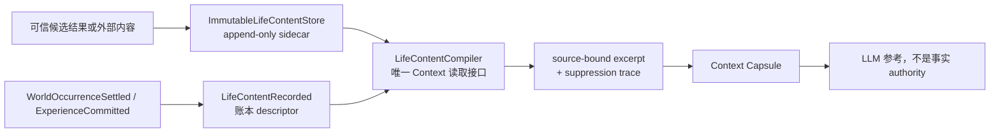
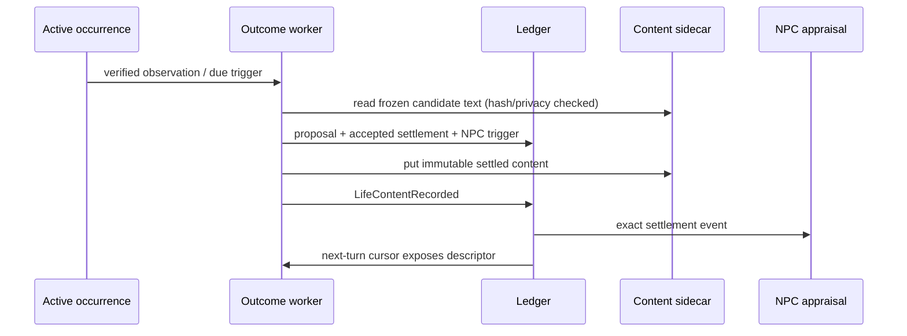

# World v2：已结算经历内容 sidecar

状态：实施设计  
日期：2026-07-15  
关联：`docs/world-v2-refactor-plan.md` §4B、`docs/design/world-v2-memory-retrieval-content.md`

## 目标与边界

World v2 的账本已经可以证明某个世界事件发生、由谁结算、采用哪个结果；它
故意只保存 `result_payload_ref`、hash 与 authority identity。这个选择避免了
把 LLM 的说明文字误当成世界事实，但也留下一个体验断点：下一轮 Capsule 只见
到 opaque ref，角色无法真正“记得刚才发生了什么”。

本设计补的是**内容读取权**，不是新的世界事实权，也不是回复正文的第二个入口。
它必须同时满足：

- 模型只能看见由已结算 occurrence 或已提交 Experience 精确绑定的内容；
- 内容在指定历史 cursor 之前不可见，因此 replay 仍然确定；
- 缺内容、hash 不符、权限不足时 fail closed，绝不根据 ref 名称或模型补写；
- 世界结果、主观经历总结、已接受回复三者保持不同 authority；
- Context 只调用一个深模块，不拥有 SQLite、hash、隐私或截断的细节。

首版不允许模型为已经发生的世界结果自由撰写正文。结果文本必须来自冻结的候选
结果或可信外部结果；Experience 的总结可以是角色的主观表达，但不能反向作为
Fact、Outcome 或 Action 的证据。

## 统一术语

| 术语 | 含义 | 不能替代 |
| --- | --- | --- |
| Settlement authority | `WorldOccurrenceSettled` 的事件、revision、payload hash | 结果正文 |
| Experience authority | `ExperienceCommitted` 的事件、revision、payload hash | 记忆摘要正文 |
| Content descriptor | 账本内不可变的 `LifeContentRecorded`，把某 authority 与某正文 ref/hash/privacy 绑定 | 文本存储本身 |
| Immutable content sidecar | 保存 exact UTF-8 正文的只增不改存储 | 事实或 proposal evidence |
| Excerpt | descriptor 校验后、按固定预算截取的模型输入 | 新的账本事实 |

`MessagePayloadStored` / `LedgerAuthorizedPayloadReader` 只表示已经接受的外发回复，
绝不能复用为世界结果或经历内容库；否则“说过的话”和“发生过的事”会共享错误的
授权边界。

## 架构



`LifeContentCompiler` 是深模块，公开接口只有：

```python
compile(
    *,
    cursor: ProjectionCursor,
    actor_ref: str,
    viewer_privacy_ceiling: PrivacyClass,
    budget: LifeContentBudget,
    projection: LedgerProjection | None = None,
) -> LifeContentResult
```

调用者不传 event、ref、SQLite query 或文本；选择关联 occurrence/Experience、验证
authority、校验 sidecar、隐私门控、排序、全局预算和 suppression 均封装在模块内。
这避免 `ContextResolver`、`MemoryRetrievalCompiler` 和未来 evaluator 各自复制一套
稍有差异的读取规则。

sidecar 是真实 seam，有两个 adapter：

```python
class ImmutableLifeContentStore(Protocol):
    def put_if_absent(self, record: StoredLifeContent) -> None: ...
    def read_exact(self, *, content_ref: str) -> StoredLifeContent | None: ...

# test: InMemoryImmutableLifeContentStore
# production: SQLiteImmutableLifeContentStore
```

生产 adapter 与 ledger 使用同一个 SQLite 文件、不同表；它不依赖 `SQLiteWorldLedger`
的私有表或 transaction 实现。写入协调器先 `put_if_absent`，再原子追加 descriptor：
前一步成功、后一步失败最多产生不可见孤儿；反向顺序会形成可见但无法校验的内容，
因此禁止。读取一律以 descriptor 为准，孤儿永不被枚举。

## Descriptor contract

新增不可变账本事件 `LifeContentRecorded`。其概念字段如下：

```text
content_id
content_kind: occurrence_result | experience_summary
content_ref
content_payload_hash              # sha256 of complete exact UTF-8 text
privacy_class

source_kind: occurrence_settlement | experience
source_event_ref
source_world_revision
source_payload_hash
source_entity_id
source_entity_revision
```

在 reducer 与 batch invariant 中强制：

1. descriptor 只能位于对应 source authority 之后；source event/type/revision/hash 必须
   精确匹配。
2. `occurrence_result` 必须匹配 settlement 的 `result_payload_ref/hash` 与 occurrence
   id/revision；`experience_summary` 必须匹配 `ExperienceValues.summary_ref/hash` 与
   experience id/revision。
3. descriptor 的 privacy 不得宽于 source authority；`withhold` 从不产生模型 excerpt。
4. 每个 `source + content_kind` 只有一个 descriptor；同 ref 不能换 hash、不能重新
   绑定另一个 source。
5. descriptor 是 cursor 可见性的唯一锚点：descriptor 事件以前的历史视图必须
   `content_unavailable`，即使 sidecar 较早已有孤儿内容。
6. sidecar 的 UTF-8 byte hash 必须等于 descriptor；任何不符均 fail closed。

旧的 `ref/hash` 只有 hash 算法不满足 contract、或没有可信文本时，继续不可用。迁移
不得猜测文本，也不得把 payload ref 命名当作摘要。

## 模型视图、预算与隐私

`LifeContentResult` 包含 `settled_items`、`experience_items` 与结构化 suppressions。
每个可见 item 至少带：

```text
content_kind, content_ref, content_payload_hash, text, truncated
privacy_class
source_entity_id, source_entity_revision
authority_event_ref, authority_world_revision, authority_payload_hash
descriptor_event_ref, descriptor_world_revision, descriptor_payload_hash
```

文本仅以 Unicode code-point 前缀做确定性截断。选择顺序固定为：较近的 settled
时间/experience 时间优先，随后 source entity id 升序；先应用每条上限，再应用总
预算。每一个被省略的项目给出可审计原因：

```text
not_related | privacy_ceiling | descriptor_missing | source_proof_failed |
content_missing | hash_mismatch | budget_exhausted
```

`WorldLifeContextCompiler` 将变成这个深模块的兼容 facade；`MemoryRetrievalCompiler`
仅从 `LifeContentCompiler` 请求 Experience summary excerpt。两者都不得直接打开
sidecar。Context Capsule 将 excerpt 的 authority/descriptor ref 写入 trace，然而
Deliberation、Fact、Outcome 和 Action 的 evidence validator 仍只接受账本 authority，
不接受 excerpt text 或 sidecar ref。

## 与 Outcome 闭环的衔接

Outcome worker 不能在候选结果只有 opaque ref 的情况下让模型盲选。它应使用相同的
source-bound reader 查看冻结 candidate 的可用内容；内容缺失或 privacy 拒绝时只可
输出 `no_proposal`，不得编造结果。成功结算后，其 descriptor 可使下一轮对话和
NPC appraisal 看见精确的结果摘要；NPC 心理反应仍以 settlement authority 为因果源。



具体 writer 可以将 descriptor 同 outcome acceptance 的后续受控提交完成；无论采用
同批还是紧邻提交，都必须只在 settlement 已提交后记录 descriptor，并可重跑幂等。

## 交付顺序与验收

1. 先实现 descriptor schema、event catalog、reducer、projection、batch invariants 与
   authority/tamper fixtures。
2. 实现 in-memory 与 SQLite sidecar adapter，覆盖 close/reopen。
3. 实现 compiler，覆盖 source、cursor、hash、privacy、排序与 Unicode/总预算。
4. 将 world life 与 Experience-backed memory 接线到 Capsule。
5. 由 Outcome authority reader 复用该 compiler 的候选内容读取能力，再实现
   `outcome_deliberation` worker。

必须通过的测试包括：篡改 source/ref/hash、descriptor 早于 source、重复或冲突
descriptor、sidecar 缺行/篡改、隐私越权、descriptor 前后 cursor、SQLite 重启、固定
截断与排序、下一轮 Capsule 可读、Experience-backed MemoryCandidate 可读，以及文本
无法被反向当成 Fact/Action/Outcome evidence。
